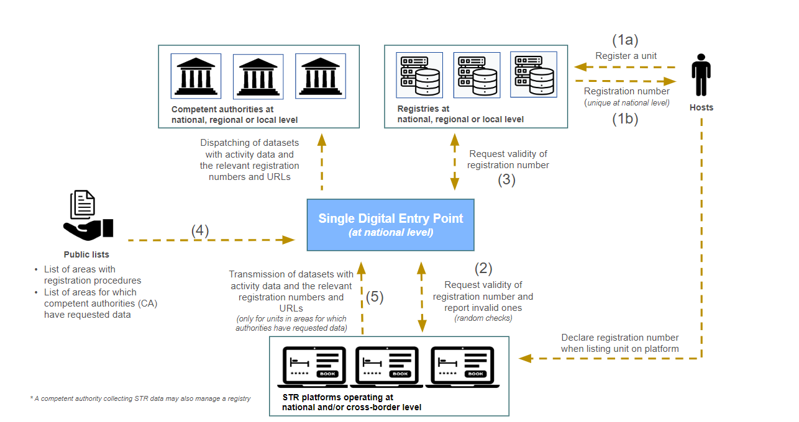
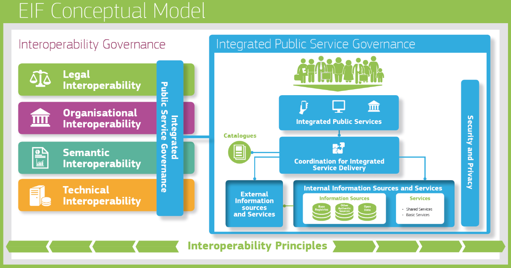
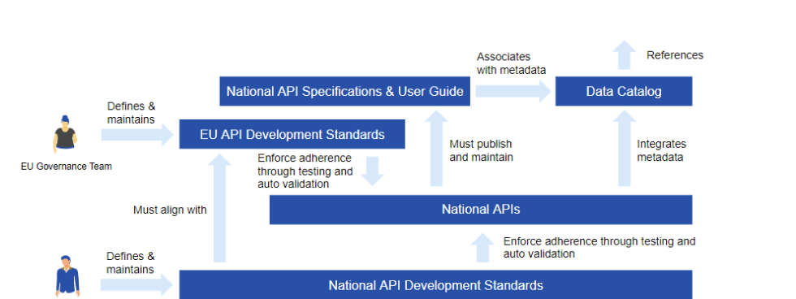

  

| Settings  | Value |
|-------------------|----------------------|
| Document Title   | Best practices and specific recommendations for Member State public authorities to setup STR registries, recommendations for reusable solutions for the development of a SDEP and common specifications for data exchanges and validation checks – Interim Version |
| Project Title | Interoperability solutions in the area of Short-Term Rental (STR) services |
| Document Author | PwC EU Services |
| Project Owner |  DG GROW - European Commission |
| Project Manager | Travers Wouter  - PwC EU Services |

| Disclaimer  |
|-----------|
| This report was prepared for DG Grow by PwC EU Services. The views expressed in this report are purely those of the authors and may not, in any circumstances, be interpreted as stating an official position of the European Commission. The European Commission does not guarantee the accuracy of the information included in this report, nor does it accept any responsibility for any use thereof. Reference herein to any specific products, specifications, process, or service by trade name, trademark, manufacturer, or otherwise, does not necessarily constitute or imply its endorsement, recommendation, or favouring by the European Commission. All care has been taken by the author to ensure that s/he has obtained, where necessary, permission to use any parts of manuscripts including illustrations, maps, and graphs, on which intellectual property rights already exist from the titular holder(s) of such rights or from her/his or their legal representative.|

# Table of Content

1. [Introduction](#1-introduction)
   - 1.1. [Context and target audience](#11-context-and-target-audience)
   - 1.2. [Objectives and scope](#12-objectives-and-scope)
   - 1.3. [List of Abbreviations](#13-list-of-abbreviations)
2. [Interoperable standards](#2-interoperable-standards)
   - 2.1. [Key concepts and definitions](#21-key-concepts-and-definitions)
   - 2.2. [Importance of interoperability](#22-importance-of-interoperability)
3. [Main results and benefits of the best practices and recommendations](#3-main-results-and-benefits-of-the-best-practices-and-recommendations)
   - 3.1. [Data model](#31-data-model)
   - 3.2. [Base Registries](#32-base-registries)
      - 3.2.1. [Architecture](#321-architecture)
      - 3.2.2. [Data Quality](#322-data-quality)
      - 3.2.3. [Data Security Policy](#323-datasecuritypolicy)
      - 3.2.4. [Data Governance](#324-data-governance)
         - 3.2.4.1.  [Responsibilities for Base Registries](#3241-responsibilities-for-base-registries)
         - 3.2.4.2.  [Collaboration methods](#3242-collaboration-methods)
         - 3.2.4.3.  [API Governance](#3243-api-governance)
         - 3.2.4.4.  [Data Roles and Responsibilities](#3244-data-roles-and-Responsibilities)
      - 3.2.6. [Metrics on data management](#326-metrics-on-data-management)
      - 3.2.7. [Cost of setting up STR registries](#327-cost-of-setting-up-STR-registries)
   - 3.3. [SDEP: API standards](#33-sdep-API-standards)
      - 3.3.1. [Communication Protocols](#331-communication-protocols)
      - 3.3.2. [Authentication](#332-authentication)
      - 3.3.3. [Data Format](#333-data-format)
      - 3.3.4. [Specific Requests](#334-specific-requests)
      - 3.3.5. [Response Codes](#335-response-codes)
      - 3.3.6. [Frequency of Actions](#336-frequency-of-actions)      
4. [Conclusion](#4-conclusion)

# 1. Introduction  
This chapter sets the stage by defining the context and identifying the target audience for this document, ensuring relevance and clarity for the readers. It outlines the objectives and scope, providing a roadmap of the goals and boundaries of the report's analysis. A list of abbreviations is included for easy reference to terms used throughout the text. 

## 1.1. Context and target audience  

This report provides a comprehensive guide on setting up and operating STR registries, SDEPs, and data exchanges for Member State authorities and STR platforms. The goal is to enable smooth and interoperable information sharing and reuse on short term rentals among EU Member States and STR platforms, with efficient access, data integrity, and security.

This requires using interoperable standards for STR base registries that facilitate information sharing and management. This involves using consistent and compatible definitions, a data model, and communication protocols across systems, as well as understanding the key concepts and terms in the short term rental industry. Additionally, this involves applying effective data and information management practices to ensure data quality and trustworthiness within STR registries.

Setting up a SDEP requires following best practices to ensure efficient access to information and services. This includes using standardised data formats, protocols, and interfaces for interoperability and compatibility across systems and platforms, as well as implementing robust data security measures, such as strong authentication and access controls, to protect sensitive information. This also includes establishing effective governance frameworks and coordination mechanisms among stakeholders to ensure the smooth functioning and optimal utilisation of the SDEP. In this context, efficient data exchanges among Member State authorities and STR platforms are essential for effective collaboration and information sharing.

Moreover, focusing on important concepts and terminologies in the short term rental industry and raising awareness about effective data and information management practices are key to the success of these systems.

## 1.2. Objectives and scope  

These best practices aim to enhance collaboration and efficiency among EU Member States and Platforms.

  

The best practices are following the STR framework legal documents. In order to ensure a smooth understanding of the STR framework, let us briefly recap its functioning as described by the regulation. 

The first step involves hosts registering their units (1a) through the appropriate registration procedure at the relevant CA. This Authority can be at the national, regional, or local level. Once registered, hosts are required to declare their received registration number (1b) to the platform when listing their unit. 

Platforms have the responsibility to regularly verify the validity (2) of the registration numbers and declarations provided by the hosts. This verification process is facilitated through the SDEP (3). The declarations pertain to hosts who must declare whether their unit is located in an area that necessitates a registration procedure and number. The list of these areas is made public through the SDEP (4) to enable effective checks. Any invalid registration numbers or declarations are to be reported to the CA. 

Lastly, platforms are obligated to submit activity data (5) to the CA in areas where a registration procedure is required, using the SDEP. 

The bigger goal of promoting semantic and technical interoperability among EU Member States and platforms is achieved by using interoperable data and technical standards and giving advice on how to make different systems work together. 

We want to highlight that this is an open source document allowing anyone to contribute, modify, and improve upon it. This collaborative approach brings together a diverse range of knowledge and expertise, resulting in more comprehensive and up-to-date best practices and recommendations. 

| Guidelines|
|--------------------|
|Encourage a harmonised approach to registration schemes for hosts across the EU.        |
|Leverage existing Core Vocabularies and Application Profiles, such as the Core Location Vocabulary, Core Person Vocabulary, Core Business Vocabulary, Core Public Organisation Vocabulary, and BregDCAT-AP       |
|Adopt a modular and loosely coupled service-oriented architecture (SOA) approach to achieve technical interoperability    |
|Develop a user-friendly web application for the Presentation Layer that is intuitive, easy to navigate, and accessible across different devices  |
|Employ a central database or distributed ledger system in the Information Layer to ensure data integrity and consistency   |
|Implement standardised protocols and data formats for seamless interoperability between regional-level base registries in the National Level Interconnection Layer      |
|Implement a standard Data Quality Process   |
|Make authoritative sources of information available to others while implementing access and control mechanisms to ensure security and privacy in accordance with the relevant legislation   |
|Develop interfaces with base registries and authoritative sources of information, publish the semantic and technical means and documentation needed for others to connect and reuse available information  |
|Match each base registry with appropriate metadata including the description of its content, service assurance and responsibilities, the type of master data it keeps, conditions of access and the relevant licences, terminology, a glossary, and information about any master data it uses from other base registries  |
|Create and follow data quality assurance plans for base registries and related master data.      |
|Follow RESTful API principles        |
|Utilise standard HTTP Methods to perform different operations on resources        |
|Leverage JSON for Simplicity and Wide Support        |
|Understand and handle HTTP status Codes        |
|Implement OAuth 2.0 for secure communications       |
|Test and validate API communications        |

## 1.3. List of Abbreviations  

| Abbreviation   | Explanation |
|----------|----------|
| STR   | Short-Term Rental      |
| BR   |   Base Registries    |
| DPA   | Data Protection Authorities    |
| DPO    | Data Protection Officer     |
| EIF | European Interoperability Framework       |
| MS   |  Member States      |
| SDEP   | Single Digital Entry Point        |
| DPIA   | Data Protection Impact Assessment      |
| REST  | Representational State Transfer   |

# 2. Interoperable standards 
This section highlights the critical role of **interoperable standards** in enabling different systems and organisations to communicate and work together seamlessly. By adopting such standards, platforms and Member States can ensure compatibility, facilitate data sharing, and support collaborative innovation. The importance of these standards lies in their ability to reduce complexity, lower integration costs, and create a more efficient and accessible digital environment.

## 2.1. Key concepts and definitions 
Interoperability is a foundational concept of the digital public services within the European Union, playing an important role in the exchange of data across various stakeholders such as Member States and STR platforms. It is defined by the European Interoperability Framework (EIF) as:

<blockquote>The ability of organisations to interact towards mutually beneficial goals, involving the sharing of information and knowledge between these organisations, through the business processes they support, by means of the exchange of data between their ICT systems.</blockquote>

Base registries are critical components within this framework, constituting authoritative sources of information on fundamental data items related to individuals, businesses, and assets. The EIF identifies a base registry as:

<blockquote>A trusted and authoritative source of information which can and should be digitally reused by others and in which one organisation is responsible and accountable for the collection, usage, updating and preservation of information.</blockquote>

These registries are not only vital for the administration and delivery of public services but also act as key enablers of interoperability across the EU. By adhering to interoperable standards, base registries facilitate accurate, secure, and reliable data sharing. 

The Single Digital Entry Point (SDEP) exemplifies the practical application of interoperability, functioning that allows platforms to transmit activity data efficiently to the appropriate competent authorities. The regulation states that: 

<blockquote>In order to ensure interoperability, a technical interface for online short-term rental platforms enabling the machine-to-machine and manual transmission of activity data shall be implemented using an Application Programming interface based on technical requirements defined by the commission”. However, it was not possible to maintain, as foreseen in the Council’s general approach, a status of “observers” within the coordination group for the Single Digital Entry Points, in order to be in line with the procedural rules of Commission experts’ groups. The commission evaluation will include, together with other aspects, the need to create in the future a centralised Single Digital Entry Point</blockquote>

This relies on the standardisation of data formats and protocols to operate effectively. The SDEP interoperability ensures that data exchanges are consistent, timely, and compliant with EU regulations, thereby streamlining regulatory reporting and fostering a transparent digital environment. 

The EIF's interoperability model is integral to achieving these objectives, as it offers a structured approach to embedding interoperability within digital services from the outset. This model encompasses four layers of interoperability: legal, organisational, semantic, and technical supported by the cross-cutting component of "Integrated Public Service Governance" and underpinned by a foundational "Interoperability Governance" layer. Implementing interoperable standards across these layers is crucial for creating a cohesive digital ecosystem, enabling robust data exchanges between base registries, but also between Short-Term Rental Platforms and Member States, and ensuring effective operation of the SDEP. 

  

## 2.2. Importance of interoperability  
As described before,  interoperability encompasses four layers, each addressing different aspects of how services and systems interact. For the purpose of this report, the focus will be on semantic and technical interoperability. 

* **Semantic interoperability** ensures that the precise format and meaning of exchanged data and information is preserved and understood throughout exchanges between parties, in other words ‘what is sent is what is understood.

* **Technical interoperability** covers the applications and infrastructures linking systems and services. Aspects of technical interoperability include interface specifications, interconnection services, data integration services, data presentation and exchange, and secure communication protocols.

In this case, the regulation states that: 

<blockquote>Alignment should be ensured between the various registries in a Member State as well as their interoperability with the Single Digital Entry Point in order to remove semantic and technical barriers to data sharing and to ensure more effect and efficient administrative procedures. The entities in charge of creating the Single Digital Entry Points at national level level and the Commission should facilitate implementation at national level and cooperation between Member States.</blockquote>

While legal and organisational interoperability are also crucial components of the EIF's comprehensive approach, they fall outside the scope of this report. Legal interoperability deals with ensuring that differing legal frameworks do not hinder the exchange of information, while organisational interoperability focuses on the alignment of business processes, models, and responsibilities.

These layers are essential for a complete interoperability strategy, but the current discussion is limited to the technical and semantic aspects, which are more directly applicable to the practical implementation of the STR framework.

The EIF underscores the importance of interoperability as a means to enhance the integration and cooperation between digital services and systems across the EU. 

By concentrating on semantic and technical interoperability, this report aims to address the immediate and practical needs of establishing a cohesive digital ecosystem, enabling effective data exchanges that are critical for the functioning of the implementation of the STR framework. As such, interoperability remains a cornerstone of the EU's efforts to create a more efficient, accessible, and user-focused digital landscape.

# 3. Main results and benefits of the best practices and recommendations  

This chapter outlines best practices for Base Registries, the Single Digital Entry point and data exchanges, covering data modelling, architecture, quality, security policies, and governance, including specific roles and collaboration methods. It emphasises the importance of robust data structures, high data quality, and comprehensive governance for efficient and secure data handling. The guide also delves into API specifics such as communication protocols, authentication methods, data formats like JSON, and the significance of understanding response codes related to the SDEP. Overall, these recommendations aim to ensure reliable, scalable, and secure data and API practices in line with the STR framework. 

## 3.1. Data model  

| Guidelines      |    |
|-----------|---------------|
| G | Obligate an harmonised and common data schema across the participating countries   |
| G | Leverage existing Core Vocabularies and Application Profiles, such as the Core Location Vocabulary, Core Person Vocabulary, Core Business Vocabulary, Core Public Organisation Vocabulary, and BregDCAT-AP.        |

The Short Term Rental Application Profile (STR-AP) (https://semiceu.github.io/STR-AP/) s a comprehensive data model that has been developed based on the concepts expressed in the current proposed Regulation on short-term accommodation rental services. The STR-AP aims to capture and standardise the data elements and entities relevant to the regulation, providing a structured framework for data generation and sharing in the short-term rental sector.

The data model is organised into several sections, starting with an abstract and introduction to provide an overview of the STR-AP. It further includes sections on status, licence, conformance, and terminology to establish the context and guidelines for implementation. The overview section provides a high-level overview of the data model, while the main entities section defines the core entities such as evidence, legal entity, online short-term rental platform, order, person, public organisation, registration number, registration procedure, short-term accommodation rental service, and unit.

The data model also provides datatypes and examples to guide the implementation and usage of the STR-AP. It offers specific examples, such as providing information about a unit and addressing registration procedure issues related to registration numbers. Usage guidelines are provided to support the implementation process, validation procedures, and governance requirements for versioning and re-used assets.

## 3.2. Base Registries

| Guidelines |
|--------------------------|
| Adopt a modular and loosely coupled service-oriented architecture (SOA) approach to achieve technical interoperability.    |
|Develop a user-friendly web application for the Presentation Layer that is intuitive, easy to navigate, and accessible across different devices.   |
|Employ a central database or distributed ledger system in the Information Layer to ensure data integrity and consistency.   |
|Implement standardised protocols and data formats for seamless interoperability between regional-level base registries in the National Level Interconnection Layer      |
|Implement a standard Data Quality Process   |
|Make authoritative sources of information available to others while implementing access and control mechanisms to ensure security and privacy in accordance with the relevant legislation.   |
|Develop interfaces with base registries and authoritative sources of information, publish the semantic and technical means and documentation needed for others to connect and reuse available information.  |
|Match each base registry with appropriate metadata including the description of its content, service assurance and responsibilities, the type of master data it keeps, conditions of access and the relevant licences, terminology, a glossary, and information about any master data it uses from other base registries.  |
|Create and follow data quality assurance plans for base registries and related master data.      |

### 3.2.1. Architecture

  

Base registries play a crucial role in ensuring the efficient and reliable management of data across various domains. To achieve technical interoperability, it is essential to adopt a modular and loosely coupled service-oriented architecture (SOA) approach. This report presents best practices and recommendations for the design and implementation of base registries, focusing on the key layers involved in the architecture.

The Presentation Layer serves as the user interface, enabling individuals to interact with the system. A web application should be developed, providing a user-friendly experience that is intuitive, easy to navigate, and accessible across different devices. Emphasising usability and accessibility will enhance user adoption and satisfaction.

The information layer forms the foundation of the architecture and encompasses components such as Data Storage, Data Access, and Authentication & Authorization. A central database or distributed ledger system should be employed to store all registered room information, ensuring data integrity and consistency. APIs should be provided to enable authorised access to the registered data, supporting CRUD (Create, Read, Update, Delete) operations for efficient data management. Integration with reliable authentication systems, such as EIDAS or local ID authentication, ensures secure user verification during the registration process.

The national level interconnection layer facilitates data exchange between different regions. Standardised protocols and data formats should be adopted to ensure seamless interoperability between regional-level base registries. Mechanisms for data synchronisation should be implemented to maintain consistency and uniqueness of registration numbers at the national level. Additionally, data validation processes should be in place to verify the accuracy and uniqueness of registration numbers received from other regions.

The publication Layer is responsible for exposing registered data to rental platforms. To effectively manage and secure access to APIs, a National Level API Gateway should be implemented as a centralised entry point. API Management components should handle the management, monitoring, and authentication of APIs, ensuring their availability and security. Data transformation processes should be employed to standardise the registered data format, enabling compatibility with rental platforms. The SDEP component should implement communication protocols and standards for seamless data exchange with rental platforms. This will be explained in a later section. 

### 3.2.2. Data Quality
This section delves deeper into the data quality - or data validation process as defined in the STR regulation. The process is shown on the figure below: 

  

The data quality process consists of three actors, shown by each lane: the data steward at the competent authority level, the host of an STR unit and the STR platform. The process starts when the host submits his/her personal data and unit data on the registration platform of the competent authority. The submission of this data will immediately lead to the issuance of the registration number for that unit. After the registration number is issued to the host, the data steward can, at any time, verify the declarations and supporting documents submitted by the host. In the case that incorrect or incomplete information is flagged by the data steward, the host should get the chance to rectify the information and documentation within a reasonable timeframe (to be determined by the competent authority). If the host, however, fails to rectify the information again, the data steward shall notify the host in writing stating the intention for suspension of his/her registration number. This gives the host another chance to be heard. (A direct suspension, without undue delay, is possible in the case of wilful misconduct or gross negligence.) After having heard the host, the data steward can suspend the validity of the registration number and notify the host as well as the relevant platforms about the suspension. Lastly, the STR platforms shall disable or remove the access to all listings with invalid registration numbers. The registration number will be kept suspended until the host is able to rectify the information and documentation submitted by him/her. 

To prevent the submission of incorrect or incomplete information, several suggestions can be offered. In addition to the obvious recommendations such as conducting presence checks, consistency checks, two step verification processes for contact information, and adhering to format requirements, the most crucial suggestion for ensuring data quality in STR registries is to validate against reference data. The ability for registries to interoperate will play a vital role in facilitating this validation process.

Validation against reference data involves verifying the accuracy and validity of the data provided by the host during the registration process. This is done by comparing the inputted data with trusted reference sources. By conducting this validation, it ensures that the data provided by the host is both accurate and valid. Examples of this validation mechanism include verifying addresses against entries in the national address registry, validating the identity of the host or a legal entity against national ID numbers or business numbers in the relevant registry, and so on.

To address the potential validation challenges caused by specificity requirements for unit addresses against addresses in existing address registries, two solutions can be implemented to mitigate the risk of inaccurate unit addresses. Firstly, when platforms submit their monthly activity data to the registry, checks can be conducted on the unit addresses. This can be done either automatically or manually. Under activity data we understand: 

<blockquote>Activity data’ means the number of nights for which a unit is rented and the number
of guests that the unit was rented to per night, and their country of residence, in
accordance with Regulation (EU) 692/2011</blockquote>

This allows the competent authority to verify if the unit address provided matches the one registered under that specific registration number. Additionally, the verification process can be delegated to the platforms themselves. Platforms can be required to validate if the unit address entered on their platform corresponds to the unit address associated with the provided registration number. These checks can be performed through the SDEP functionality, ensuring that platforms adhere to the validation against reference data on their own.

### 3.2.3. Data Security Policy

Data security is of utmost importance in base registries to ensure the protection of personal information and compliance with the GDPR. This section presents best practices and recommendations for implementing a robust data security policy in base registries, focusing on adhering to GDPR principles, appointing a Data Protection Officer (DPO), integrating data protection measures, conducting Data Protection Impact Assessments (DPIAs), implementing access controls and encryption, providing staff training, and conducting regular security audits and risk assessments.

  

To ensure compliance with the GDPR, base registries should adhere to key principles such as data minimization, accuracy, storage limitation, and integrity and confidentiality. Only necessary and relevant data should be collected and processed, and efforts should be made to maintain the accuracy of the data. Data should not be stored for longer than necessary, and appropriate measures should be in place to ensure the integrity and confidentiality of the data.

A DPO should be appointed if required by the GDPR. The DPO will be responsible for overseeing data protection activities, ensuring compliance with the regulation, and acting as a point of contact for data subjects and supervisory authorities. The DPO should have expertise in data protection and be independent in performing their duties.

Data protection measures should be integrated into the design of systems and processes from the beginning. Privacy and security should be considered by default, and privacy-enhancing technologies should be utilised where applicable. Making data protection the default setting in all data processing activities ensures that privacy is prioritised throughout the registry's operations.

DPIAs should be conducted for high-risk processing activities to identify and mitigate potential risks to personal data. These assessments help in evaluating the impact of data processing activities on privacy and implementing appropriate measures to protect personal information. DPIAs should be conducted regularly and updated as necessary.

Strict access controls should be implemented to ensure that only authorised individuals have access to personal data. Role-based access control and strong authentication mechanisms should be employed to prevent unauthorised access. Data encryption should be used to protect data at rest and in transit, ensuring that even if data is compromised, it remains unreadable and unusable.

Staff training and awareness programs are essential to ensure that employees understand their responsibilities in handling personal data and are aware of best practices for data security. Training should cover topics such as data protection principles, secure data handling, incident response, and reporting procedures.

Regular security audits and risk assessments should be conducted to identify vulnerabilities and assess the effectiveness of security measures. These assessments help in identifying potential threats and implementing appropriate controls to mitigate risks. Continuous monitoring should be in place to detect and respond to security incidents promptly.

Implementing a robust data security policy is crucial for base registries to protect personal information and comply with the GDPR. By adhering to GDPR principles, appointing a DPO, integrating data protection measures, conducting DPIAs, implementing access controls and encryption, providing staff training, and conducting regular security audits and risk assessments, Member States can ensure the security and privacy of base registries. These best practices and recommendations will foster trust, compliance, and interoperability, ultimately benefiting both data subjects and the organisations involved in managing base registries.

### 3.2.4. Data Governance

This section delves into the governance aspects of base registries, focusing on four key topics: responsibilities for base registries, collaboration methods, API governance, and data roles and responsibilities. Base registries play a crucial role in managing and maintaining data, and effective governance is essential to ensure their accuracy, security, and interoperability. The first topic explores the responsibilities associated with base registries. It examines the roles of regional, national, and European authorities in collecting, updating, and sharing data on various subjects, such as short-term accommodation rentals. Understanding these responsibilities is vital for establishing a robust governance framework that promotes transparency and accountability. The second topic delves into collaboration methods for base registries. It highlights the importance of collaboration between different stakeholders, including regional and national authorities, organisations, and individuals. Effective collaboration methods facilitate the exchange of information, best practices, and feedback, ultimately enhancing the overall governance of base registries. The third topic focuses on API governance, recognizing the importance of Application Programming Interfaces (APIs) in data sharing and integration. 

API governance ensures that APIs are developed, managed, and used in a standardised and secure manner, promoting interoperability and facilitating seamless data exchange between base registries and other systems. Lastly, the report explores the roles and responsibilities related to data in base registries. It emphasises the need for clear data ownership, quality assurance, security measures, and privacy protection. Understanding these roles and responsibilities is crucial for maintaining data integrity and ensuring compliance with relevant regulations and standards. By examining these four topics, this section aims to provide a comprehensive understanding of the governance aspects surrounding base registries. It highlights the importance of collaboration, API governance, and data roles and responsibilities in establishing a robust governance framework. 

#### 3.2.4.1. Responsibilities for Base Registries  

This section provides an in-depth analysis of the governance responsibilities related to base registries, specifically focusing on the management of data on short-term accommodation rentals. It examines the roles and responsibilities at the regional, national, and European levels, highlighting the key tasks and objectives of each governing body. The report also emphasises the importance of collaboration, data quality, security, and privacy in ensuring effective governance of base registries.

At the regional level, authorities are responsible for collecting, updating, maintaining, and sharing data on short-term accommodation rentals within their jurisdiction. They must comply with national and European regulations and standards, ensuring data quality, security, and privacy. Collaboration with other regional and national authorities and stakeholders is crucial, as it facilitates the exchange of information and best practices. Additionally, regional authorities should provide feedback and suggestions for improvement to enhance the overall governance of base registries.

National authorities play a vital role in the governance of base registries. They are responsible for aggregating, harmonising, storing, and distributing data on short-term accommodation rentals from different regions. Establishing and enforcing national policies and standards for data collection and sharing is essential to ensure consistency, interoperability, and compliance. National authorities should also provide a single digital entry point for data transmission between online platforms and public authorities. Collaboration with regional, European authorities, and stakeholders is necessary to foster a coordinated approach. Furthermore, national authorities should actively seek feedback and suggestions for improvement to enhance the governance of base registries.

At the European level, the focus is on facilitating, regulating, promoting, innovating, enabling, evaluating, and advocating data on short-term accommodation rentals across the EU. European authorities provide guidance, standards, and tools for the access and interconnection of base registries, ensuring seamless data exchange. Collaboration with national authorities and stakeholders is crucial to align efforts and achieve a harmonised approach. European authorities should actively seek feedback and suggestions for improvement to enhance the governance of base registries.

Effective governance of base registries is essential for the management of data on short-term accommodation rentals. Regional, national, and European authorities have distinct responsibilities that contribute to the overall governance framework. Collaboration, data quality, security, and privacy are key considerations in ensuring the success of base registries. By fulfilling their respective roles and responsibilities, these governing bodies can enhance the transparency, efficiency, and reliability of base registries, ultimately benefiting both public authorities and stakeholders in the short-term accommodation rental sector.

#### 3.2.4.2. Collaboration methods  

Collaboration is a crucial aspect of effective governance for base registries. It involves bringing together various stakeholders, including regional and national authorities, representatives from different organisations, and relevant industry players. This section explores the collaboration methods employed in base registries. 

Federated governance is a collaborative approach that involves the participation of multiple actors at different levels. It includes national and regional representatives who work together to ensure the smooth functioning of base registries. This approach promotes coordination, information sharing, and alignment with national and European policies and initiatives.

National and EU working groups should be established to facilitate collaboration and coordination among relevant stakeholders. These groups consist of representatives from national and regional authorities, as well as stakeholders such as platforms, IT experts, hosts, and base registry representatives. They meet regularly to discuss issues, exchange best practices, and align their efforts with the overall governance framework.

Interoperability is a key aspect of base registry governance. To ensure seamless data exchange and integration, a national representative is responsible for developing and implementing interoperability policies. These policies define the standards and protocols for data sharing and integration between base registries and other systems.

A documentation policy is essential for effective collaboration in base registries. It ensures that relevant policies, procedures, and guidelines are documented and readily accessible to all stakeholders. This policy helps maintain consistency, transparency, and clarity in the governance process.

Security and privacy are critical considerations in base registry governance. Policies are established to address these concerns, outlining measures to protect data integrity, confidentiality, and compliance with relevant regulations. These policies are developed and implemented by national and regional representatives, ensuring the secure management of data within base registries.

Regular meetings with other regional authorities and base registries are conducted to foster collaboration, resolve issues, and exchange best practices. These meetings provide a platform for coordination, alignment, and knowledge sharing. Additionally, participation in national workshops on base registry access and interconnection helps stakeholders stay informed and engaged in the governance process.

To promote collaboration and knowledge exchange at a broader level, European and international events and workshops are organised. These events bring together stakeholders from different countries and regions to discuss base registry access, interconnection, and governance. Ad hoc webinars and community platforms are also utilised to facilitate ongoing communication and idea exchange.

Compliance with national and European regulations and standards is a fundamental aspect of base registry governance. A compliance policy is established to ensure that all stakeholders adhere to these requirements. This policy outlines the responsibilities and obligations of stakeholders, promoting transparency, accountability, and adherence to governance principles.

Collaboration methods are essential for effective governance of base registries. The involvement of national and regional representatives, working groups, and stakeholders fosters coordination, information sharing, and alignment with policies and standards. Regular meetings, workshops, and events provide platforms for collaboration, while policies on interoperability, documentation, security, privacy, and compliance ensure the smooth functioning and integrity of base registries. By employing these collaboration methods, base registries can enhance their governance practices and contribute to the reliable and secure management of data.

#### 3.2.4.3. API Governance  

This section focuses on API governance within base registries, specifically addressing the need for interoperability and standardisation across domains and data products. Effective API governance is crucial for ensuring seamless data integration, promoting collaboration, and enabling efficient access to base registry data. This section highlights the importance of defining global and domain-level API development standards, enforcing them through testing and validation, and publishing API metadata through a data cataloging solution.

  

To achieve interoperability and standardisation, governance teams must define API development standards at both the global and domain levels. Global API development standards establish overarching guidelines and best practices that apply to all base registries. These standards ensure consistency, compatibility, and ease of integration across different domains. Domain-level API development standards, on the other hand, address specific requirements and considerations unique to each domain within the base registry. These standards take into account domain-specific data models, protocols, and business rules, ensuring that APIs are tailored to meet the specific needs of each domain.

Once API development standards are defined, governance teams must enforce them through rigorous testing and validation processes. API testing involves verifying the functionality, performance, and security of APIs to ensure they meet the defined standards. Automated metadata structure validation ensures that the API metadata adheres to the specified format, schema, and guidelines. These validation processes help identify and rectify any deviations or inconsistencies, ensuring that APIs are compliant with the defined standards.

API metadata, along with associated specifications and reference guides, should be published through a data cataloguing solution. A data cataloguing solution serves as a centralised repository for API metadata, providing a comprehensive and easily accessible source of information for developers, stakeholders, and users. The catalogue should include detailed documentation, such as API endpoints, authentication methods, and usage guidelines. 

API governance plays a critical role in ensuring interoperability and standardisation within base registries. By defining global and domain-level API development standards, governance teams establish guidelines that promote consistency and compatibility across different domains. Enforcing these standards through API testing and automated metadata structure validation helps maintain compliance and identify any deviations. Publishing API metadata via a data cataloguing solution provides a centralised source of information, enabling transparency and facilitating collaboration among developers, stakeholders, and users. By implementing robust API governance practices, base registries can enhance interoperability, streamline data integration, and promote efficient access to base registry data.

#### 3.2.4.4. Data Roles and Responsibilities  

Within base registries, various data roles and responsibilities are assigned to ensure the effective governance, management, and utilisation of data. This section explores the key data roles and their respective responsibilities. 

  

**Base Registry Owner:**
The registry owner is a public authority responsible for the overall governance, management, and maintenance of the base registry. They set strategic objectives, oversee the implementation of governance principles, and ensure compliance with legal and policy requirements. The registry owner also plays a crucial role in securing funding and resources for the base registry.

**Data Steward:**
The data steward executes the strategy of the registry data owner on a day-to-day basis. While the accountability remains with the data owner, the data steward is responsible for the operational aspects of data management. They possess a thorough understanding of the data and typically have a business profile. The data steward ensures data quality, integrity, and compliance with relevant standards and policies.

**Data Custodian:**
The data custodian provides the necessary processes and systems to capture, store, manage, and deliver the data within the base registry. They are responsible for the technical aspects of data management, including data storage, security, and access controls. The data custodian ensures that the data is properly maintained, protected, and available to authorised users.

**Data User:**
The data user is the ultimate consumer of the data within the base registry. They rely on the data for analytical or operational purposes, utilising it to make informed decisions or perform specific tasks. Data users may include individuals, organisations, or other stakeholders who require access to the data for their respective needs.

**Enterprise (or Data) Architect:**
The enterprise architect, also known as the data architect, plays a crucial role in defining the overall objectives and blueprints of the data architecture within the base registry. They bridge the gap between the functional and technical aspects, providing guidance for data management, including data quality procedures and interoperability rules. The enterprise architect acts as a business partner, offering support, guidance, and escalation points when needed.

Data roles and responsibilities within base registries are essential for the effective governance and management of data. The registry owner sets the strategic direction, while the data steward ensures the day-to-day execution of the data management strategy. The data custodian provides the technical infrastructure for data storage and delivery, while the data user utilises the data for analytical or operational purposes. The enterprise architect ensures the overall coherence and alignment of the data architecture. By assigning and fulfilling these roles and responsibilities, base registries can ensure the quality, integrity, and accessibility of data, ultimately benefiting both the registry owner and the data users.

### 3.2.6. Metrics on data management 
In the realm of short-term rental platforms, where hosts are required to register their units, the management of data within base registries emerges as a critical facet of regulatory compliance and operational efficiency. These base registries, overseen by competent authorities at various levels such as national, regional, or local, serve as repositories for essential data provided by hosts to obtain registration numbers for their rental units. In line with the European Interoperability Framework (EIF) recommendations 37 to 40, (https://ec.europa.eu/isa2/sites/default/files/eif_brochure_final.pdf)  these registries must adhere to stringent standards concerning data security, privacy, interoperability, and quality assurance. Recommendation 37 underscores the importance of implementing access and control mechanisms to safeguard the security and privacy of the personal data stored in the registries, while recommendation 38 emphasises the development of interfaces and documentation for seamless information exchange between Competent Authorities and STR Platforms. Furthermore, recommendation 39 underscores the necessity of metadata to describe the registry's content, access conditions, and relevant licences, among other details, ensuring transparency and accountability. Lastly, recommendation 40 stresses the need for robust data quality assurance plans to maintain the integrity and reliability of the data stored within these registries. Delving deeper into the key performance indicators (KPIs) associated with these recommendations offers insights into the effectiveness and efficiency of data management practices within base registries, providing a comprehensive understanding of their role in facilitating regulatory compliance and enabling smooth operations within the short-term rental ecosystem.

Two KPIs can be defined to assess the implementation of recommendation 37 in the context of STR registries.

**KPI 1**: Extent to which the STR registry is available for reuse and integration within the digital infrastructure supporting STR services. This KPI utilises a unit of measurement from 0 to 5, where 0 indicates that the STR registry lacks support for multilingualism or tailored data representation for the sector, hindering its integration with digital public services, while 5 signifies comprehensive support for multilingualism and specialised data representation within the STR registry, facilitating seamless integration and reuse across the STR ecosystem.

**KPI 2**: Extent to which public administrations within the STR regulatory framework make authoritative sources of information, particularly those housed within the base registries, available to other national or cross-border public administrations. This KPI employs a unit of measurement from 0 to 5 as well, where 0 denotes that none of the base registries relevant to the STR sector are accessible to other public organisations for the provision of public services, and 5 signifies that all pertinent base registries are accessible and utilised by other public entities to enhance service delivery and regulatory compliance within the STR ecosystem.

The first KPI defined to assess the implementation of recommendation 37 can also be applied on recommendation 38. In addition, the following KPI should be used as well:

**KPI 3**: Existence of agreements on reference data, such as taxonomies, controlled vocabularies, thesauri, code lists, and reusable data structure/models, specifically tailored to achieve semantic interoperability within the Short-Term Rental (STR) registry ecosystem. This KPI employs a scale of measurement from 0 to 5, where 0 signifies the absence of agreements within the STR registry framework to achieve semantic interoperability, impeding data exchange and integration, while 5 indicates comprehensive agreements in place across all relevant STR registries, ensuring seamless semantic interoperability and facilitating efficient data sharing and reuse.

An additional two KPIs can be determined to assess the implementation of recommendation 39.

**KPI 4**: Existence of metadata, master data, and reference data management policies specifically tailored to the Short-Term Rental (STR) registry domain. This KPI employs a scale of measurement from 0 to 3, where 0 signifies the absence of any dedicated policies governing metadata, master data, or reference data management within the STR registry context, while 3 indicates the presence of comprehensive policies addressing these aspects, ensuring effective management and utilisation of data within the STR registry ecosystem.

**KPI 5**: Existence of a registry of Base Registries relevant to the Short-Term Rental (STR) sector or existence of a registry of Base Registries in general that includes the STR registry, as well as the availability of this registry at a cross-border level. This KPI utilises a binary measure: 0 or 1. A score of 0 indicates the absence of a registry of Base Registries (specifically for the STR domain or in general) within a country, while a score of 1 signifies the presence of such a registry. Additionally, the availability of this registry at a cross-border level is similarly measured, where 0 indicates unavailability and 1 indicates availability.

Lastly, two KPIs can be defined for the assessment of recommendation 40.

**KPI 6**: Extent to which the Short-Term Rental (STR) base registry draws up and implements a data quality assurance plan to ensure the quality of its data. This KPI utilises a scale from 1 to 5, where 1 represents strong disagreement with the presence of a data quality assurance plan, indicating inadequate measures to ensure data quality, and 5 represents strong agreement, signifying robust implementation of a comprehensive data quality assurance plan that effectively maintains the quality and reliability of data within the STR registry.

**KPI 7**: Existence of master data management and Quality Assurance (QA) plans specifically tailored for the Short-Term Rental (STR) base registry. This KPI utilises a binary measure: 0 or 1. A score of 0 indicates the absence of master data management and QA plans for the STR registry, while a score of 1 signifies the presence of master data management and QA plans tailored specifically for the STR registry, ensuring systematic efforts to uphold data quality and integrity within the STR ecosystem.

### 3.2.7. Cost of setting up STR registries.  

The exact cost of developing STR registries in a specific country is difficult to determine, because it can significantly differ from country to country depending on which authority is responsible for the implementation of the STR regulation (national, regional or local). Furthermore, the cost of setting up STR registries and a registration platform greatly depends if these systems are developed in-house (taking into account the necessary capabilities are present) or by an external contractor. 

Nevertheless, by the example from one of the Member States, already at a mature stage of development of its registration system and which will be operated in an online capacity, a comprehensive overview of the expenses and efforts could be given. The Member State has assigned a dedicated team of 10 staff members to develop, establish, maintain, and implement the STR register. This team is supported by other teams within the Member State, including Legal, ICT, and Finance. The development of technical solutions for the register includes creating an online registration portal, an API, a back-end database, and updating the Member State’s website to provide information about the STR register to the public. External contractors have been engaged to assist with developing the registration portal, translation services (for the Member State’s official language content), customer service agents for handling public queries, and external communications for a public information campaign prior to the register’s launch.

Reflecting on the user story of the Member State and the diverse components assembled to initiate their system, one could leverage this insight to estimate the costs involved in establishing similar components for their own country. This assessment would draw upon their personal experiences in setting up analogous components.

## 3.3. SDEP: API standards

| Guidelines|
|--------------------------|
|Follow RESTful API principles   |
|Utilise standard HTTP Methods to perform different operations on resources  |
|Leverage JSON for Simplicity and Wide Support   |
|Understand and handle HTTP status Codes  |
|Implement OAuth 2.0 for secure communications    |
|Test and validate API communications    |

### 3.3.1 Communication Protocols 

This section provides an overview of the communication protocols that are foundational to the operation of the SDEP and more specifically the recommendation of the RESTful APIs. RESTful APIs have become a cornerstone of modern web services due to their simplicity, scalability, and stateless operations. A key component of RESTful APIs is the use of standard communication protocols, primarily HTTP (Hypertext Transfer Protocol), to facilitate interactions between clients and servers. This will examine the principles of REST, the role of HTTP methods, status codes, and other elements that contribute to the robustness and functionality of RESTful API communication applied to the STR framework.  REST prescribes a set of constraints that, when followed, lead to a performant, scalable, and reliable system. RESTful APIs use standard web protocols and methods to allow for communication between clients and servers.

A RESTful system is defined by six guiding constraints:

* Client-Server Architecture: A separation of concerns is maintained between the user interface and data storage, improving the portability of the user interface and scalability of the server components
* Stateless: Each request from the client to the server must contain all the information necessary to understand and complete the request. The server does not store any session information about the client.
* Cacheable: Responses must define themselves as cacheable or not, to prevent clients from reusing stale or inappropriate data.
* Uniform Interface: A consistent and standardised interface simplifies and decouples the architecture, which enables each part to evolve independently.
* Layered System: A client cannot ordinarily tell whether it is connected directly to the end server or to an intermediary along the way.
* Code on Demand (optional): Servers can extend client functionality by transferring executable code.

HTTP is the principal and recommended protocol used in RESTful API communication. It operates as a request-response protocol in the client-server computing model. A RESTful web service would typically define the following HTTP methods:

* GET: Retrieve a resource from the server.
* POST: Send data to the server for a new resource.
* PUT: Update a resource on the server.
* DELETE: Remove a resource from the server.
* PATCH: Apply partial modifications to a resource on the server.

Each method serves a different function in the API ecosystem and aligns with the principles of REST.

REST APIs use standard MIME types to define the format of the data being communicated. The recommended format is application/json which indicates that the data is in JSON format.

To secure communications, The OAuth 2.0 authorization framework has been selected to provide robust security for RESTful API communications. OAuth 2.0 enables third-party applications to obtain limited access to an HTTP service, either on behalf of a resource owner or by allowing the third-party application to obtain access on its own behalf. This is achieved through access tokens, which are granted by an authorization server and used by the client application to access protected resources hosted by the resource server.

OAuth 2.0 provides various grant types for different use cases, such as:

* Authorization Code: For apps running on a web server, browser-based and mobile apps.
* Implicit: For browser-based or mobile apps where the access token is returned directly.
* Resource Owner Password Credentials: For trusted applications, such as those owned by the service itself.
* Client Credentials: For applications accessing their own service.
  
By integrating OAuth 2.0 into the RESTful API architecture, developers can ensure that access to resources is controlled and secure. It also facilitates scalability and flexibility, as different clients may require different types of authorization.

  

1. Request for Access Grant:
   * The Platform initiates the process by requesting an access grant from the SDEP Authorization Server. The request includes the scope and type of data the Platform intends to share.
2. Verification of Credentials:
   * The SDEP Authorization Server verifies the Platform's credentials and the legitimacy of the request.
3. Issuance of Grant:
   * If the Platform is authorised, the Authorization Server issues a grant.
4. Exchange of Grant for Access Token:
   * The Platform exchanges the grant for an access token by sending it back to the SDEP Authorization Server.
5. Validation of Grant and Issuance of Access Token:
   * The Authorization Server validates the grant and issues an access token to the Platform.
6. Data Transmission Request:
   * The Platform uses the access token to request data transmission by sending it to the SDEP Resource Server, which is typically an API endpoint capable of handling data transfers.
7. Validation of Access Token and Receipt of Data:
   * The SDEP Resource Server validates the access token and then receives the activity data from the Platform.
8. Data Processing and Forwarding:
   * The SDEP processes the data, in JSON format, and forwards it to the Competent Authority.

Communication protocols are the backbone of RESTful APIs, enabling the structured and secure exchange of information over the web. By adhering to the principles of REST and utilising the standard methods and status codes of HTTP,  Member States at national level can create an API that is efficient and reliable to receive activity data from the platforms.  

### 3.3.2 Authentication  

This section discusses the practical implementation of OAuth 2.0 as a security measure for transmitting activity data from a STR platform to a Competent Authority through a RESTful API. It outlines the steps required to ensure secure access and the integrity of the data during transit within a REST architecture. Integrating OAuth 2.0 with a RESTful API provides a secure way for STR platforms to share data with Competent Authorities while adhering to industry standards for authorization.

The OAuth 2.0 framework's roles remain consistent within a REST architecture:

* Client: The client in this scenario is the STR platform itself, which needs to access the competent authority's API to send activity data. The STR platform acts on behalf of the user (itself or an administrator of the platform) to request access to the resource server.

* Resource Server: The resource server is the server where the activity data is stored and managed. In this scenario, it would be the server hosting the competent authority's API that the STR platform needs to interact with. This server holds the protected resources and is capable of accepting and responding to protected resource requests using access tokens.

* Authorization Server: The authorization server is the server that authenticates the identity of the STR platform and issues access tokens after getting proper authorization from the resource owner. In some cases, the authorization server may be a separate entity from the resource server, but it can also be part of the same system. For a government authority, the authorization server would likely be a secure system that ensures only authorised entities can access the API.

The Client Credentials Grant is appropriate for machine-to-machine communication where the client is a trusted server. The RESTful API will serve as the interface through which the STR platform's activity data is securely accessed:

1. The Competent Authority's system sends a POST request to the STR platform's Authorization Server's token endpoint, including its client ID and client secret in the authorization header or body.
2. The Authorization Server authenticates the client and issues an access token in JSON format, which is returned in the response body.
3. The Member States’ (as on a national level) system includes the access token in the Authorization header as a Bearer token when making requests to the STR platform's RESTful API.
4. The RESTful API validates the access token and, if valid, processes the request and sends back the requested activity data in the response body in JSON format. 

To further enhance security in the RESTful API context, the following measures can be adopted:
* Use TLS to ensure data encryption and secure transmission of requests and responses.
* Implement token expiration and renewal strategies to mitigate the risk associated with token leakage.
* Define scopes narrowly to limit the Member States’ (as on a national level)  access to only the data necessary for their functions.
* Use API gateways or service meshes that provide additional security features like rate limiting, logging, and anomaly detection.
* Validate input data on the RESTful API to prevent injection attacks and ensure data integrity.

When integrating OAuth 2.0 with a RESTful API, certain best practices should be followed:
* Keep the Authorization Server separate from the Resource Server for improved security and scalability.
* Use stateless access tokens, such as JWT (JSON Web Tokens), which can be self-contained and validated without needing to store session state.
* Regularly rotate client secrets and ensure they are stored securely.
* Monitor and log all access to the RESTful API to detect and respond to suspicious activities promptly.
* Ensure compliance with relevant data protection regulations such as GDPR or CCPA when handling personal data.

Integrating OAuth 2.0 with a RESTful API is a secure and effective way to manage the authorization of data transmissions between an STR platform and a Member States’ (as on a national level) . By using the Client Credentials Grant and adhering to security best practices, the STR platform can provide authorised access to its data while maintaining the confidentiality, integrity, and availability of the information exchanged. 

### 3.3.3 Data Format 

To share activity data with Competent Authorities in a secure, structured, and standardised manner we propose a JSON format. 

JSON is a widely-accepted, text-based data interchange format that is easy for humans to read and write, as well as easy for machines to parse and generate. This paper aims to articulate the benefits of using JSON, its structure, and an example of its application in a RESTful API for data transmission.

The need for efficient data exchange between STR platforms and regulatory bodies is critical for compliance and oversight. JSON stands out as a preferred format for many web-based APIs due to its simplicity and compatibility across various systems. 

JSON encodes data structures like objects and arrays, along with basic data types such as strings, numbers, booleans, and null.

JSON offers several advantages for data transmission, including:
* **Wide Support**: JSON is supported natively in most programming languages, making it a universal format for APIs.
* **Lightweight**: With a simple syntax, JSON is more compact than other data interchange formats like XML, reducing overhead in data transmission.
* **Readability**: JSON's structure is clear and understandable, both for developers and for machines, facilitating debugging and development.
* **Speed**: JSON's lightweight nature also results in faster parsing and serialization, which can be critical for high-performance applications.
  
JSON uses a straightforward syntax that represents objects as collections of key-value pairs enclosed in curly braces {} and arrays as ordered lists of values enclosed in square brackets []. Keys are strings, and values can be strings, numbers, objects, arrays, true, false, or null.

JSON is an effective format for data interchange between an STR platform and a Competent Authority, providing a straightforward, readable, and lightweight method of structuring data. Its ease of use and widespread support make it a practical choice for RESTful API development and integration. 

### 3.3.4 Specific Requests
Specific requests, in the context of the SDEP, refer to the various types of HTTP requests that clients can make to interact with the SDEP and perform specific actions or operations on the available resources. 

The most relevant requests in case of the STR framework are:

1. GET: The GET request is used to retrieve data. 

2. POST: The POST request is used to submit data. 

This section aims to provide a comprehensive understanding of the specific requests involved in the STR framework and their purpose.  These are subject to discussion. In the end an agreement needs to be made on: 

- **Endpoints (method, name, purpose)**
- **Response / Request bodies (what data in which format)**
- **Order of actions / requests**

* GET: /area
Purpose: This request is used to retrieve a list from the CA defining geographic data about areas subject to the regulation.

  

* GET: /orders
Purpose: This request is used to access a queue hosted by the CA containing orders for the STR Platforms.

  

* POST: /listings
Purpose: This request allows clients to submit listings to the CA for analysis to determine if they comply with the regulations.

  

* POST: /activity-data
Purpose: This request enables the sharing of activity data with the CA.

  

### 3.3.5 Response Codes
This section offers a comprehensive examination of HTTP response status codes as they pertain to RESTful API communication. These status codes are an integral part of the HTTP protocol and provide immediate feedback about the result of an HTTP request. They play a critical role in design of the SDEP and client-server interaction by helping to quickly identify the nature of the response, whether it indicates success, redirection, client error, or server error. The correct use of HTTP status codes enhances the robustness of the SDEP and aids developers in troubleshooting and handling responses appropriately.

RESTful APIs operate on the principles of the HTTP protocol, which includes a system of response status codes that are returned by the server to indicate the outcome of a client's request. These codes are standardised and understood universally by HTTP clients, making them a vital component of the API ecosystem. This report delves into the recommended categories and specific codes regarding the within those categories, explaining their meanings and implications in the context of RESTful APIs.

HTTP response status codes are divided into five categories, each signifying a general type of response:
* 1xx (Informational): Indicative of an ongoing process or a provisional response.
* 2xx (Success): Confirmation that the request was received, understood, and accepted.
* 3xx (Redirection): Indication that further action is needed to complete the request.
* 4xx (Client Error): Notification of an error that seems to have been caused by the client.
* 5xx (Server Error): Indication of an error on the server side, preventing the fulfilment of a valid request.

Within each category, there are several specific status codes that RESTful APIs often use. In case of the SDEP, the relevant response codes are:

Success Responses: 
* 200 OK: The standard response for successful HTTP requests. The actual response will depend on the request method used.
* 202 accepted: The standard response code indicating that the request has been accepted for processing. 
* 204 No Content: The server successfully processed the request, but is not returning any content.

Redirection messages: 
* 301 Moved Permanently: This response code indicates that the URI of the requested resource has been changed permanently.
* 302 Found: This code indicates that the URI of the requested resource has been changed temporarily.

Client Error Responses: 
* 400 Bad Request: The server cannot or will not process the request due to an apparent client error (e.g., malformed request syntax).
* 401 Unauthorized: Similar to 403 Forbidden, but specifically for use when authentication is required and has failed or has not yet been provided.
* 403 Forbidden: The request was valid, but the server is refusing action. The user might not have the necessary permissions for a resource.
* 404 Not Found: The requested resource could not be found but may be available again in the future.
* 405 Method Not Allowed: This response code means that the server recognizes the resource but does not support the requested HTTP method (e.g., GET, POST, PUT, DELETE) for that resource.

Server Error Response: 
* 500 Internal Server Error: A generic error message, given when an unexpected condition was encountered and no more specific message is suitable.
* 501 Not Implemented: The standard response code that indicates that the server does not support the functionality required to fulfill the request.
* 502 Bad Gateway: The server was acting as a gateway or proxy and received an invalid response from the upstream server.
* 503 Service Unavailable: The server is currently unavailable (because it is overloaded or down for maintenance).
* 504 Gateway Timeout: The server was acting as a gateway or proxy and did not receive a timely response from the upstream server.
  
Using HTTP status codes effectively involves more than simply returning the correct code. It includes:
* **Precise Use of Codes**: Select the most accurate status code for each situation to best inform the client of the needed action or result.
* **Consistency**: Apply status codes consistently across your API to avoid confusing consumers.
* **Informative Error Responses**: When errors occur, provide additional information in the body of the response to help clients understand and resolve the issue.

HTTP response status codes are a fundamental aspect of the RESTful API design and are critical for effective client-server communication. By returning the appropriate status codes, API developers can provide clear and actionable information about the result of each request, aiding in the development of resilient and user-friendly APIs. 

# 4. Conclusion  

To maximise the effectiveness of STR registries and the SDEP, Member States are encouraged to adopt best practices, an interoperable data model and explore reusable solutions, thereby promoting interoperability and minimising redundant efforts. The adoption of common specifications for data exchanges will enable a uniform approach to data sharing, enhancing the quality and reliability of the data received. Validation checks should be implemented to ensure the accuracy and integrity of data, thus supporting effective monitoring and enforcement activities.

It is crucial for public authorities to engage in continuous dialogue with all stakeholders, including STR platforms, local communities, and industry associations. This collaborative approach is essential for addressing the diverse challenges and opportunities within the STR market. 

The European Commission acknowledges the importance of technical assistance and the sharing of best practices among Member States. The Commission aims to continue to play it’s role in supporting and facilitate the exchange of expertise to assist in the development of scalable, secure, and user-centric digital solutions. These efforts are in alignment with the Digital Single Market strategy and the broader objectives of the European Union to foster economic growth, enhance competitiveness, and protect the rights of EU citizens.

In the spirit of cooperation and mutual benefit, the Member States are invited to consider the recommendations presented in this report. By doing so, they will contribute to a cohesive and resilient digital ecosystem that upholds the values and regulations of the European Union. The successful implementation of these initiatives will be a testament to Europe's commitment to digital transformation and a testament to the collective resolve to advance the digital economy for the benefit of all European citizens.

The Commission remains steadfast in its commitment to providing a framework that supports innovation while ensuring a fair, transparent, and accountable digital economy. As we move forward, the actions taken today by Member States in implementing STR registries and the SDEP will pave the way for a more connected and prosperous Europe. The Commission looks forward to witnessing the positive outcomes that will arise from these efforts and to continuing its role in facilitating this important work.

