# Pulumi projects
This repository holds 3 pulumi projects:
* The kafka project that is used to deploy a kafka cluster on Confluent
* the AWS project that is to deploy all AWS infrastructure including the EKS cluster
* The charts project that is used to deploy Helm Charts on the EKS cluster

To deploy a new version of the application code on the EKS cluster. First the application docker image needs to be built, 
This is automated on the application code repository: `https://github.com/your-org/your-repo`. This repository has a semver package for the docker image.

After the image build is done, the Helm Chart app version can be updated here: `https://github.com/your-org/your-repo/blob/your-commit-id/chart/str/Chart.yaml#L24`.

The deployment of the new version happens by the Pulumi project: `charts`.

The deployment can be verified with `kubectl` (you should have the `kubeconfig.yaml` of the environment and AWS credentials of the AWS account).

```text
kubectl describe deployment your-app -n your-namespace  

```
```text
Name:                   str  
Namespace:              str 
CreationTimestamp:      [Mon, 17 Jun 2024 12:11:50 +0200]  
Labels:                 app.kubernetes.io/instance=[your-deployment]  
                        app.kubernetes.io/managed-by=[Helm]  
                        app.kubernetes.io/name=[your-deployment]  
                        app.kubernetes.io/version=[v0.0.24]  
                        helm.sh/chart=[your-deployment-0.1.0]  
Annotations:            deployment.kubernetes.io/revision: [4]  
Selector:               app.kubernetes.io/instance=[your-deployment],app.kubernetes.io/name=[your-deployment]  
Replicas:               [2] desired | [2] updated | [2] total | [2] available | [0] unavailable  
StrategyType:           [RollingUpdate]  
MinReadySeconds:        [0]  
RollingUpdateStrategy:  [25%] max unavailable, [25%] max surge  
Pod Template:  
  Labels:           app.kubernetes.io/instance=[your-deployment]  
                    app.kubernetes.io/managed-by=[Helm]  
                    app.kubernetes.io/name=[your-deployment]  
                    app.kubernetes.io/version=[v0.0.24] (Latest version of the code)  
                    helm.sh/chart=[your-deployment-0.1.0]  
  Service Account:  str 
  Containers:  
   [your-container]:  
    Image:        ghcr.io/[your-org]/[your-repo]:[v0.0.24]  
    Port:         [4443/TCP]  
  
'''

## Kafka configuration
```zsh
pulumi config set project:name [your-name]   
pulumi config set confluentcloud:cloudApiKey [your-key] [add key]  
pulumi config set confluentcloud:cloudApiSecret [your-secret] --secret

pulumi config set --path 'kafka:topics[0]' listings
pulumi config set --path 'kafka:topics[1]' activity-data
```

to get stack output
```zsh
pulumi stack output
```

To get the api secret
```zsh
pulumi stack output appApiSecret --show-secrets
```

## AWS configuration
### template
# General config  
pulumi config set aws: [eu-west-1]  
pulumi config set project:name [project name]  
pulumi config set project:namespace [namespace]  
pulumi config set project:vpcCidr [CIDR block e.g., "10.30.0.0/21"]  
  
# Domain to expose app on  
pulumi config set project:hostname [hostname]  
pulumi config set project:domain [domain e.g., "example.com"]  
pulumi config set project:domainHostedZoneId [hosted zone ID]  
  
# The nlb generated by nginx-ingress reference  
pulumi config set project:nlbHostedZoneId [NLB hosted zone ID]  
pulumi config set project:nlbDnsName [NLB DNS name]  
  
# Export of the k8s config  
pulumi stack output kubeconfig > [kubeconfig file name].yml  
export KUBECONFIG=./[kubeconfig file name].yml

## Chart configuration
```zsh
# General config
pulumi config set aws:region [your-region]   
pulumi config set project:namespace [your-namespace]   
pulumi config set project:name [your-project-name]   
pulumi config set project:efs [your-efs-id]  
  
Config for letsencrypt  
pulumi config set cert:emailContact [your-email@example.com]   
pulumi config set acme:serverUrl [https://acme-v02.api.letsencrypt.org/directory]   
pulumi config set project:awsStackRef [your-org]/[your-project]/[your-environment]  
  
Secret for docker image pull  
pulumi config set image:password [your-docker-password] --secret  
  
Next 2 values are only needed for local development, when using cert-manager the tls secret will be generated  
pulumi config set tls:key $(base64 -i [your-path]/[your-key-file].pem) --secret   
pulumi config set tls:crt $(base64 -i [your-path]/[your-crt-file].pem) --secret  
  
Reference to the local chart definition  
pulumi config set chart:file https://github.com/SEMICeu/STR-AP/tree/main/prototype/1.%20Technical_%20EU%20STR%20-%20Code%20Single%20Digital%20Entry%20Point/str-ap-internal-0.0.28/str-ap-internal-0.0.28/chart/str
pulumi config set values:file  https://github.com/SEMICeu/STR-AP/tree/main/prototype/1.%20Technical_%20EU%20STR%20-%20Code%20Single%20Digital%20Entry%20Point/str-ap-internal-0.0.28/str-ap-internal-0.0.28/values-pilo
  
References for the app connection towards kafka  
pulumi config set kafka:boostrapServers [your-kafka-servers]   
pulumi config set kafka:username [your-kafka-username] --secret   
pulumi config set kafka:password [your-kafka-password] --secret  
```

### Overview of resources
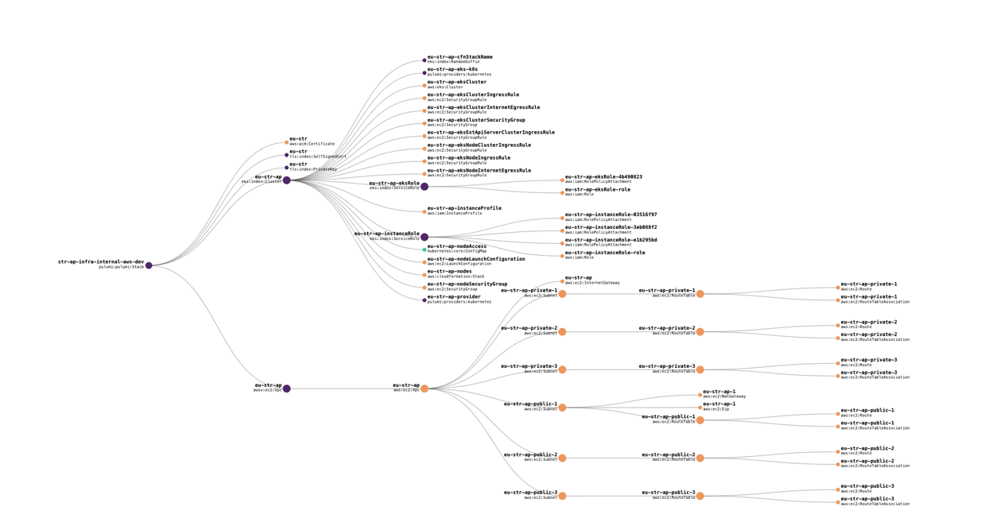

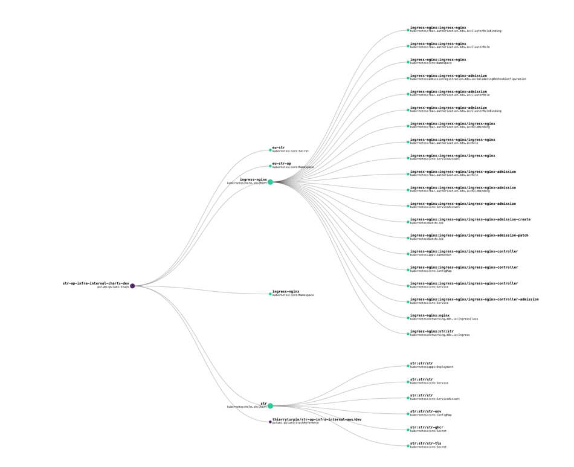

## AWS account bootstrap
* Activate MFA
* IAM user and role access to Billing information
* IAM user creation with role:
* Creation of `[your-group-name]` group with role: `AdministratorAccess`
* Creation of IAM user: [your-email@example.com]
* IAM user login URL: [https://your-account-id.signin.aws.amazon.com/console]
* Login with IAM user and setup MFA
* Domain registration: `[your-domain]` without auto-renew!

todo:
* Set alternate contacts

## Procedure to deploy a new version of the code

Your code changes should be integrated (merged) into the main branch of the repo.

In the GitHub releases or on Swagger you can see the current version number, e.g., `v0.0.24`. 
You should tag your commit with the next version, e.g., `v0.0.25`.
Note that semver uses a small v!

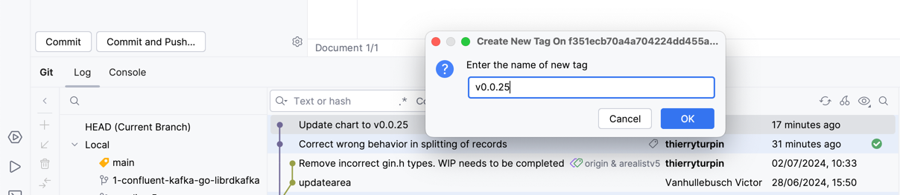

And push this tag to GitHub.

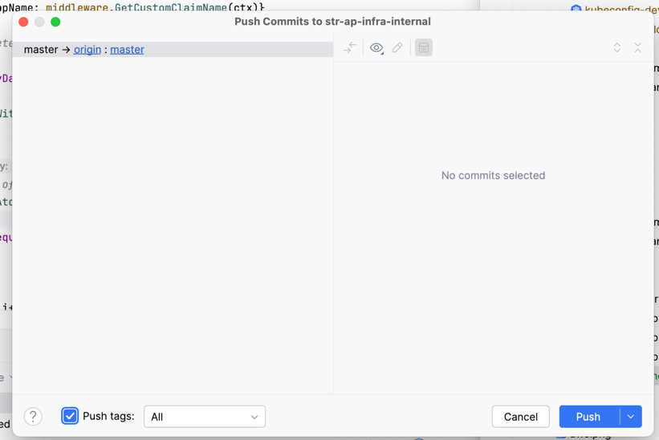

This will launch a GitHub action in the repository.

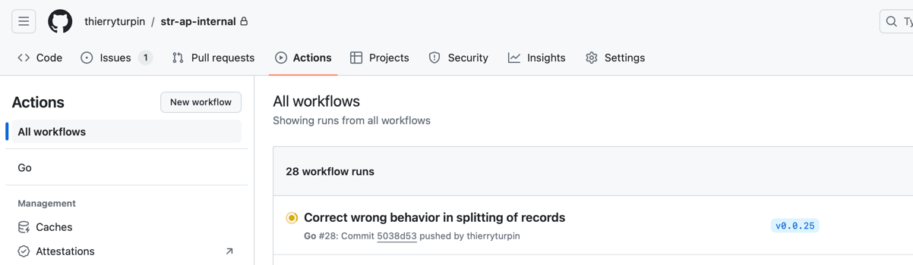

Verify the build is successful; the build will create a new release and a new version of the Docker image.

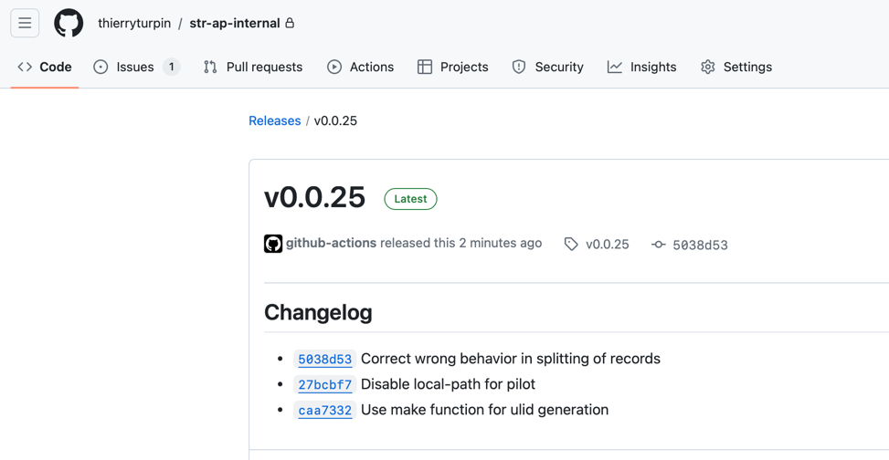

The details of the build:

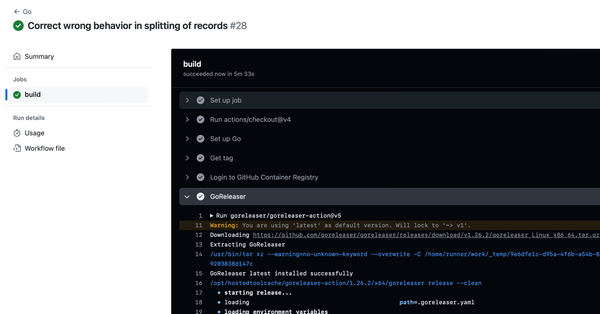

If the new version `v0.0.25` is ready to be deployed, update the version number of the chart.

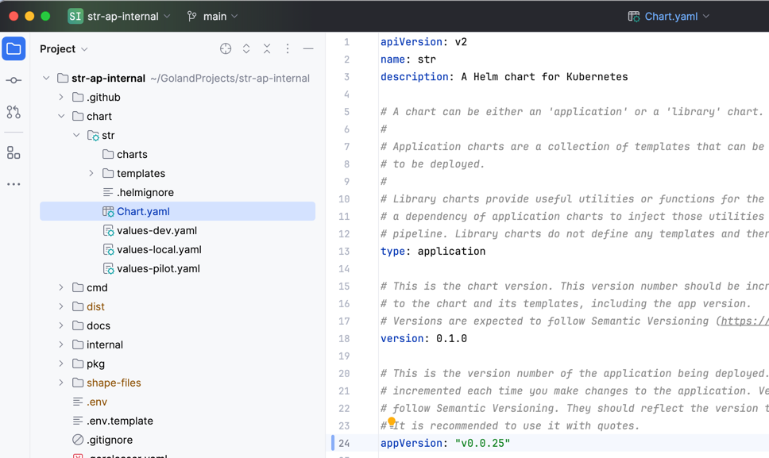

Commit and push this change.

In this repository [infra-internal](https://github.com/SEMICeu/STR-AP/tree/main/prototype/2.%20Technical_%20EU%20STR%20-%20Infra%20Single%20Digital%20Entry%20Point) a GitHub action is foreseen for Helm charts deployment.
This workflow needs to be triggered manually.

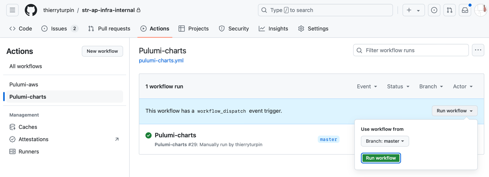

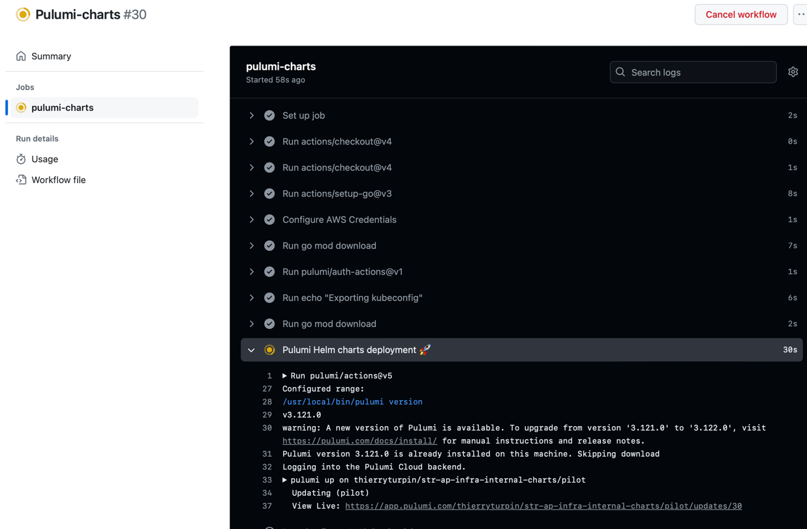

Note, this can take a couple of minutes.

The log will indicate the deployment will be updated:
```sh
~  kubernetes:apps/v1:Deployment your-deployment:your-namespace/your-deployment updating (4s) [diff: ~metadata,spec]; Waiting for app ReplicaSet to be available (0/1 Pods available)
```
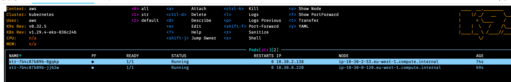
