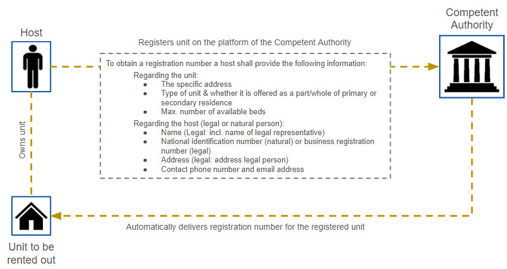
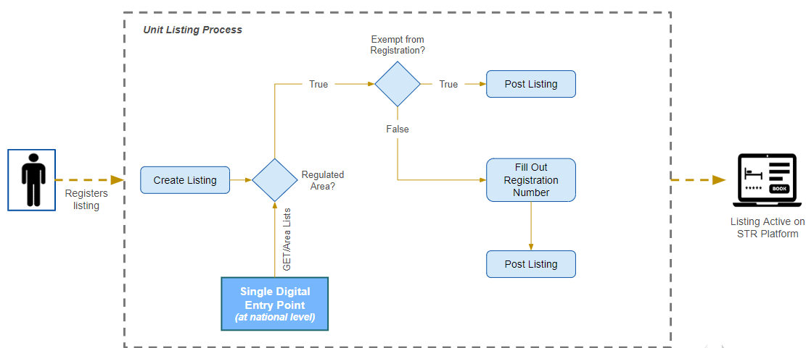
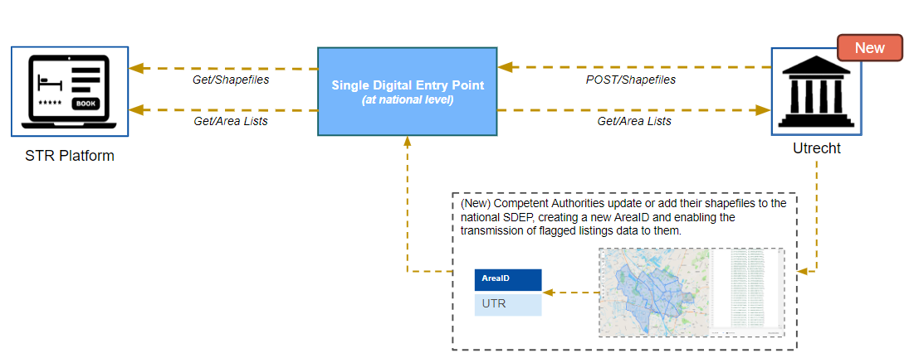
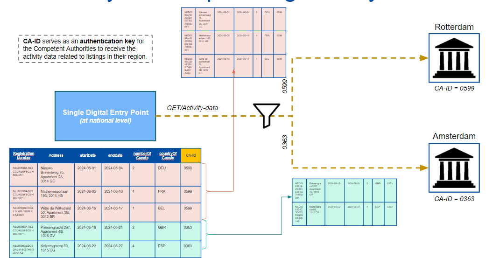
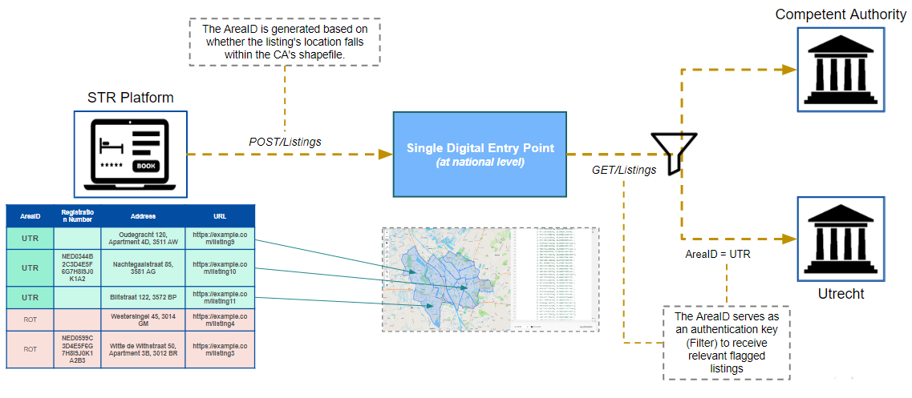

# STR - SDEP User Stories

# Epic 1
## User Story 1.1 - Host Data Submission 
## User Story 1.2 - Registration Number Issuance 

  

If you are a host with a unit located in an area that mandates a registration number, you need to register your unit with the relevant competent authority. During this registration process, you must provide detailed information about both your unit and yourself. The specific data required may vary depending on whether you are registering as a natural person or a legal entity.

For the unit, you need to submit:
- The specific address of the unit
- The type of unit (e.g., apartment, house)
- Whether the unit is part or whole of your primary or secondary residence
- The maximum number of available guests

For the host of the unit, you need to provide:
- The name
- If the host is a legal entity, you need to provide the name of any legal representative
- The national identification number or, if applicable, the business registration number
- The address or the address of any legal representative
- A contact phone number and email address

After the information has been submitted correctly, the platform of the competent authority will automatically generate and provide a registration number.

## User Story 2 - Unit Listing (Not part of the prototype)

  

First, the host creates the listing on the STR platform by filling in all the necessary information about the unit. When it comes to the registration number. The exact process can differ between platforms, where some platforms can choose to support the self declaration check of the host but this is not required. The host is solely responsible for making sure that it has a registration number listed if required. 

The host need to determine if it’s unit is in such an STR area and whether their unit is exempt from the registration requirement. Properties like hotels, hostels, and campgrounds are not part of the regulation and are typically exempt. If the unit is exempt, the listing can be posted without a registration number. 

By following these steps, hosts can ensure their listings comply with local regulations and are properly registered when required.

# Epic 3
## User Story 3.1: Activity Data Sharing

  

When a competent authority uploads or updates a shapefile, an AreaID is created or updated for all points within the shapefile of that particular authority.

In this example, the municipality of Utrecht in the Netherlands has uploaded its shapefile to the Single Digital Entry Point. This upload creates a new AreaID in the area list of regions requiring a registration procedure, as well as in the list of areas requiring the transmission of activity data. The shapefile reflects all points under this area, and all those points within the shapefile will be assigned the corresponding AreaID of Utrecht. (UTR)

STR platforms can access the list of areas requiring a registration procedure and the transmission of activity data, along with the relevant AreaIDs, via the GET/AreaLists endpoint. Additionally, they can obtain the associated shapefiles through the GET/Shapefiles endpoint.

## User Story 3.2: Area List Updates

  

When a competent authority uploads or updates a shapefile, an AreaID is created or updated for all points within the shapefile of that particular authority.

In this example, the municipality of Utrecht in the Netherlands has uploaded its shapefile to the Single Digital Entry Point. This upload creates a new AreaID in the area list of regions requiring a registration procedure, as well as in the list of areas requiring the transmission of activity data. The shapefile reflects all points under this area, and all those points within the shapefile will be assigned the corresponding AreaID of Utrecht. (UTR)

STR platforms can access the list of areas requiring a registration procedure and the transmission of activity data, along with the relevant AreaIDs, via the GET/AreaLists endpoint. Additionally, they can obtain the associated shapefiles through the GET/Shapefiles endpoint.

## User Story 3.3: Dispatching Activity Data

  

Each record of the activity data has a Competent Authority ID added, which acts as a filter to ensure the data is sent to the correct authority. When a competent authority uses the GET/ActivityData endpoint, it employs its Competent Authority ID as an authorization key to retrieve the relevant activity data containing the same ID in all its records.

Returning to our previous example where an STR platform wants to send its activity data containing five records to the appropriate competent authority, we can see that three of these data records pertain to units located in the city of Rotterdam and two of them pertain to units in the city of Amsterdam.

# Epic 4 
## User Story 4.1: Share listings flagged in random checks
## User Story 4.2: Order Removal Based on Listing URL and/or Registration Number (not part of the prototype)

  

When an STR platform flags a listing, it uses the POST/Listings endpoint to share this information. The system checks if the specific address of the flagged listing falls within the shapefile of a competent authority that requires a registration procedure. If it does, an AreaID for that competent authority is assigned to the listing. As a result, the shared list of listings now all have an assigned AreaID.

In the next stage, the competent authority can use their AreaID as an authentication key or filter to receive the relevant flagged listings located within their region. This ensures that each competent authority only receives listings pertinent to their jurisdiction.

In the example shown, an STR platform shares a list of five flagged listings with the Single Digital Entry Point. The addresses of the flagged listings are matched against the correct shapefile to assign an AreaID to each record. In this case, three of the flagged listings fall within the shapefile of Utrecht and are therefore assigned the AreaID of Utrecht.

In the second stage, the city of Utrecht uses its AreaID to retrieve the relevant flagged listings that belong to their jurisdiction.

