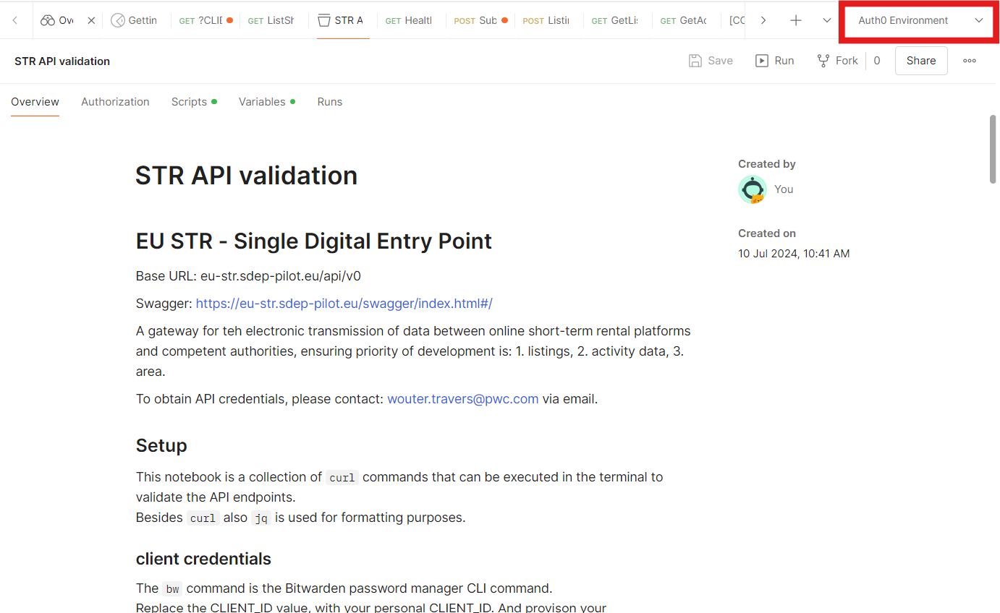

# Testing the STR - Single Digital Entry Point Prototype with Postman  
  
## Overview  
This repository provides a comprehensive guide for testing the Single Digital Entry Point Prototype using Postman. The goal is to ensure the reliability and performance of the Prototype by leveraging Postman's powerful API testing capabilities. 
  
## Getting Started  
To get started with testing the STR application using Postman, follow these steps:  
- [Download and install Postman](https://www.postman.com/downloads/).  

- **Import the Collection from the Postman folder:**
Open Postman and go to "File" > "Import".
Select the collection JSON file to import.

- **Import the Environment:**
Click "Import" and select the environment JSON file.

- **Set Up Personal Credentials:**
After importing the environment, go to "Environments". 
Edit the imported environment and replace placeholder values with actual credentials.

- **After importing the collection, please do not forget to add your personal environment by adding it on top right**

  

- **Understand the API endpoints, load the provided dummy or your own dummy data.**
  
## Resources  
- [Postman Documentation](https://learning.postman.com/docs/getting-started/introduction/)  

