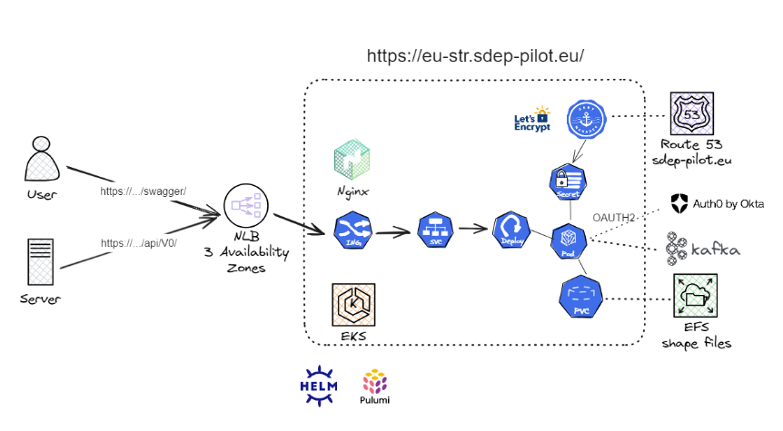

<p align="center">
  
</p>

| <span style="background-color:#1c4fa4; color:white">Settings</span> | Value                                                                      |
|---------------------------------------------------------------------|----------------------------------------------------------------------------|
| Document Title                                                      | D06.01 Report on the Prototype – Member States                             |
| Project Title                                                       | Interoperability solutions in the area of Short-Term Rental (STR) services |
| Document Author                                                     | PwC EU Services                                                            |
| Project Owner                                                       | DG GROW - European Commission                                              |
| Project Manager                                                     | Travers Wouter  - PwC EU Services                                          |

| Disclaimer                                                                                                                                                                                                                                                                                                                                                                                                                                                                                                                                                                                                                                                                                                                                                                                                                                                                                                                                                                                    |
|-----------------------------------------------------------------------------------------------------------------------------------------------------------------------------------------------------------------------------------------------------------------------------------------------------------------------------------------------------------------------------------------------------------------------------------------------------------------------------------------------------------------------------------------------------------------------------------------------------------------------------------------------------------------------------------------------------------------------------------------------------------------------------------------------------------------------------------------------------------------------------------------------------------------------------------------------------------------------------------------------|
| This report was prepared for DG Grow  by PwC EU Services. The views expressed in this report are purely those of the authors and may not, in any circumstances, be interpreted as stating an official position of the European Commission. The European Commission does not guarantee the accuracy of the information included in this report, nor does it accept any responsibility for any use thereof. Reference herein to any specific products, specifications, process, or service by trade name, trademark, manufacturer, or otherwise, does not necessarily constitute or imply its endorsement, recommendation, or favouring by the European Commission. All care has been taken by the author to ensure that s/he has obtained, where necessary, permission to use any parts of manuscripts including illustrations, maps, and graphs, on which intellectual property rights already exist from the titular holder(s) of such rights or from her/his or their legal representative. |

# Table of Content

1. [Executive Summary](#1-executive-summary)
2. [Introduction](#2-introduction)
3. [Overview of the EU Regulation and Requirements](#3-overview-of-the-eu-regulation-and-requirements)
    - 3.1. [Background and objectives](#31-background-and-objectives)
    - 3.2. [Key compliance aspect](#32-key-compliance-aspect)
4. [API Endpoints and Usage](#4-api-endpoints-and-usage)
    - 4.1. [Endpoint specifications](#41-endpoint-specifications)
        - 4.1.1. [General Endpoints](#411-general-endpoints)
        - 4.1.2. [Endpoints for Competent Authorities](#412-endpoints-for-competent-authorities)
            - 4.1.2.1. [Retrieving Activity Data Endpoint](#4121-retrieving-activity-data-endpoint)
            - 4.1.2.2. [Retrieving Listing Data Endpoint](#4122-retrieving-listing-data-endpoint)
    - 4.2. [Authentication and authorization](#42-authentication-and-authorization)
5. [Technical Infrastructure](#5-technical-infrastructure)
    - 5.1. [User and Server Requests](#51-user-and-server-requests)
    - 5.2. [Network Load Balancer (NLB)](#52-network-load-balancer-nlb)
    - 5.3. [Nginx Ingress Controller](#53-nginx-ingress-controller)
    - 5.4. [Kubernetes Service](#54-kubernetes-service)
    - 5.5. [Pods](#55-pods)
    - 5.6. [Persistent Volume Claim (PVC)](#56-persistent-volume-claim-pvc)
    - 5.7. [Apache Kafka Integration](#57-apache-kafka-integration)
    - 5.8. [Infrastructure Management](#58-infrastructure-management)
6. [Testing Steps](#6-testing-steps)
   - 6.1. [Via Terminal Commands](#61-via-terminal-commands)
       - 6.1.1. [Authentication](#611-authentication)
       - 6.1.2. [Get the OAUTH Token (from the /token endpoint)](#612-get-the-oauth-token-from-the-token-endpoint)
       - 6.1.3. [Define the HOST](#613-define-the-host)
       - 6.1.4. [Health Check Endpoint Test (endpoint 1 for Member States)](#614-health-check-endpoint-test-endpoint-1-for-member-states)
       - 6.1.5. [Retrieving Activity Data Endpoint (endpoint 2 for Member States)](#615-retrieving-activity-data-endpoint-endpoint-2-for-member-states)
       - 6.1.6. [Upload Shapefile(s) for Areas where a Registration Procedure Applies (endpoint 3 for Member States)](#616-upload-shapefiles-for-areas-where-a-registration-procedure-applies-endpoint-3-for-member-states)
       - 6.1.7. [Delete Data Area Shapefile Endpoint (endpoint 4 for Member States)](#617-delete-data-area-shapefile-endpoint-endpoint-4-for-member-states)
       - 6.1.8. [Retrieving Listing Data Endpoint (Endpoint 5 for Member States)](#618-retrieving-listing-data-endpoint-endpoint-4-for-member-states-endpoint-5-for-member-states)
       - 6.1.9. [Upload STR Area Shapefile Endpoint (endpoint 6 for Member States)](#619-upload-str-area-shapefile-endpoint-endpoint-6-for-member-states)
       - 6.1.10. [Delete STR Area Shapefile Endpoint (endpoint 7 for Member States)](#6110-delete-str-area-shapefile-endpoint-endpoint-7-for-member-states)
    - 6.2. [Via Postman](#62-via-postman)
7. [Field Level Specification](#7-field-level-specification)

# 1. Executive Summary

The D06.01 Report on the Prototype – Member States – provides a comprehensive overview of the interoperability solutions
in the area of Short-Term Rental (STR) services, developed in response to the STR European Union regulations. The
report, prepared by PwC EU Services for DG GROW - European Commission, outlines a prototype with best practices for the
technical and regulatory framework necessary for Member States.

The report begins with an introduction to the EU regulation mandating the reporting of short-term rental activities. It
details the regulation's background, objectives, and key compliance aspects, emphasising the necessity for a Single
Digital Entry Point (SDEP) to facilitate data integration and reporting.
The document provides detailed specifications for the API endpoints developed for data transmission. It includes
practical examples of GET and POST requests, guiding developers on how to interact with the SDEP effectively and
securely. The endpoints cover health checks, activity data submission, shapefile downloads, and invalid listing reports.

The report delves into the technical backbone of the prototype, explaining the use of Kubernetes for container
orchestration, Pulumi for infrastructure as code, Go for backend services, AWS for cloud solutions, Kafka for data
streaming, and Helm charts for managing Kubernetes applications. This section highlights the robust and scalable
architecture designed to ensure secure and efficient data transmission.

Step-by-step instructions for setting up the environment and deploying the prototype are provided. This includes
guidance on connecting to the API endpoints, ensuring accurate data transmission and validation, and leveraging tools
like Postman for testing.

By following the guidelines and leveraging the resources provided in this report, developers and integrators will be
well-equipped to ensure compliance with the EU regulation, contributing to the overarching goal of transparent and
accountable short-term rental activities. The prototype's sophisticated technology stack and contemporary architectural
patterns guarantee secure, scalable, and efficient data transmission, aligning with EU regulatory requirements and
enhancing overall efficiency.

# 2. Introduction

In response to the recent European Union regulation requiring short-term rental (STR) platforms to transmit activity
data to designated authorities via a Single Digital Entry Point (SDEP), this document offers detailed guidance on
connecting to the newly established API endpoints. These endpoints are integral to a prototype designed to ensure
compliance with this regulation, facilitating smooth data integration and reporting.

The prototype employs a sophisticated technology stack and contemporary architectural patterns to guarantee secure,
scalable, and efficient data transmission. The employed technologies and methodologies include Kubernetes clusters for
container orchestration, Pulumi for infrastructure as code, Go for backend service development, AWS Services for cloud
infrastructure, Kafka architecture for reliable data streaming, Helm charts for Kubernetes application management, and
standard API GET/POST requests for data interaction.

This document is organized to provide a thorough overview of each component, offering explicit instructions and best
practices for effective API endpoint usage. By adhering to the guidelines presented, developers and integrators will be
well-equipped to ensure compliance with the EU regulation, contributing to the overarching goal of transparent and
accountable short-term rental activities.

By following the detailed instructions and leveraging the resources provided, stakeholders can achieve seamless
integration with the Single Digital Entry Point, thereby aligning with EU regulatory requirements and enhancing the
overall efficiency.

# 3. Overview of the EU Regulation and Requirements

## 3.1. Background and Objectives

The development of the Short-Term Rental (STR) prototype represents a significant advancement in aligning with the new
STR regulations aimed at standardising and improving the management of short-term rental accommodations across EU Member
States. This prototype is designed to capture and implement the key functionalities outlined in the STR framework,
ensuring compliance with legal requirements and enhancing the efficiency of data exchanges between public authorities
and STR platforms.

To achieve these goals, the prototype is based on a set of best practices that were developed earlier, following the
guidelines provided in the STR framework legal documents. The STR framework details several key steps that underpin the
management of short-term rentals. The process begins with hosts registering their rental units with the appropriate
Competent Authority (CA), which could be at the national, regional, or local level (Step 1a). Following registration,
hosts are required to declare their registration number when listing their unit on the platform (Step 1b). Platforms
then have the responsibility to regularly verify the validity of these registration numbers and declarations (Step 2)
through the Single Digital Entry Point (SDEP) (Step 3). The SDEP also plays a crucial role in publishing the list of
areas where registration is required (Step 4), enabling platforms to perform effective compliance checks. Furthermore,
platforms are obligated to submit activity data (Step 5) to the relevant CA in regions where registration is mandatory,
utilising the SDEP to facilitate this reporting process.

<p align="center">
  
</p>

While the framework establishes the regulatory groundwork, this report shifts focus towards the technical implementation
of the functionality of the STR regulation and the developed recommendations. Specifically, this report covers the API
endpoints and their usage, the underlying technical infrastructure, and the implementation steps that Member States can
follow to deploy the prototype in their own environments. Additionally, it addresses best practices and security
concerns that must be considered to ensure the system's effectiveness and integrity.

## 3.2. Key Compliance Aspect

The STR prototype was developed based on a set of user stories that were collaboratively agreed upon by a working group
comprising representatives from several EU Member States and STR platforms. These user stories were designed to meet the
minimum requirements of the STR regulation for both public authorities and platforms, ensuring that the prototype would
effectively support compliance and facilitate the necessary data exchanges. Below is a breakdown of the key user stories
relevant to Competent Authorities:

### User Story 1: Host Registration

This user story outlines the process by which hosts must register their short-term rental units with the relevant
Competent Authority (CA). Hosts are required to provide comprehensive details about their unit, including the address,
type, and capacity, as well as personal information such as their name, identification number, and contact details. Upon
completing the registration process, the CA issues a unique registration number that the host must declare when listing
their unit on an STR platform.

<p align="center">
  
</p>

### User Story 2: Unit Listing

The second user story focuses on the process of listing a rental unit on an STR platform. However, since this process
does not involve any direct actions by the Competent Authority (CA), it is not elaborated further in this version of the
report. The primary responsibility for ensuring compliance during the listing process lies with the host and the STR
platform, with the CA playing a more passive role in this particular user story.

Regarding the User Stories related to activity data sharing and the sharing of flagged listings, we make the distinction
between Member States who have multiple (regional) Competent Authorities and those having only one national Competent
Authority.

Update, October 14th:
The meeting with the MS indicated there was misalignment regarding user story 2. Resolution steps are ongoing.

**Scenario A - Member States with multiple Competent Authorities**

The following user stories have been divided into 2 scenario’s. The first scenario (A) relates to Member States with
multiple Competent Authority (CA) the second (B) refers to a national level CA.

Scenario A - MS with multiple CA’s: User Story 3.1: Activity Data Sharing

This user story focuses on how the Competent Authority (CA) manages and retrieves activity data submitted by STR
platforms. The CA plays a crucial role in ensuring that the data received corresponds to rental units within its
jurisdiction.

When STR platforms submit activity data through the Single Digital Entry Point (SDEP), this data initially lacks a
direct association with a specific Competent Authority. To assign the correct , the SDEP uses the
GET/RegistrationNumbers endpoint. This call allows the SDEP to cross-reference the registration numbers linked to the
activity data with the base registry of the CA(s) in the Member State. If the registration number is present in the CA's
registry, the system assigns the corresponding competentAuthorityId_validated and competentAuthorityName_validated to
the activity data records.

This process ensures that each piece of activity data is accurately attributed to the appropriate jurisdiction. Once the
competentAuthorityId_validated is assigned, the Competent Authority can retrieve and manage the activity data that
pertains specifically to its area of responsibility, enabling effective monitoring and enforcement of the STR
regulations within its jurisdiction.

<p align="center">
  
</p>

**Scenario A - MS with multiple CA’s: User Story 3.2: Area List Updates**

This user story outlines the role of the Competent Authority (CA) in managing and updating the geographical areas where
short-term rental regulations apply. The CA is responsible for defining and maintaining the boundaries of these areas to
ensure accurate compliance by hosts and STR platforms.

Through the POST/area endpoint, the CA can upload or update shapefiles that define the specific regions within its
jurisdiction where registration and activity data reporting are required. When a shapefile is uploaded or modified, the
CA needs to mandatory add the relevant competentAuthorityId_Area and competentAuthorityName_Area . This is then included
in the list of areas where registration procedures and data reporting obligations are enforced.

By managing these shapefiles, the CA ensures that the geographical scope of the regulation is clearly defined and
accessible to STR platforms. This allows platforms to accurately determine whether a listing falls within a regulated
area and must adhere to the registration and reporting requirements.

This user story outlines the role of the Competent Authority (CA) in managing and updating the geographical areas where short-term rental (STR) regulations apply. The CA is responsible for defining and maintaining the boundaries of these areas to ensure accurate compliance by hosts and STR platforms.

Through the POST/area endpoint, the CA can upload or update shapefiles that define the specific regions within its jurisdiction where registration and activity data reporting are required. When a shapefile is uploaded or modified, the CA must include the relevant competentAuthorityId_Area and competentAuthorityName_Area. This information is then added to the list of areas where registration procedures and data reporting obligations are enforced.

By managing these shapefiles, the CA ensures that the geographical scope of the regulation is clearly defined and accessible to STR platforms. This allows platforms to accurately determine whether a listing falls within a regulated area and must adhere to the registration and reporting requirements.

Update, February 24th: 
In the prototype, two additional endpoints have been introduced.  One endpoint (str-area) identifies where STR regulation is applicable, and the other specifies where the Member State wishes to receive activity data (data-area). This approach could serve as a potential path for developing the area endpoint, as these shapefiles will typically be the same for both regulatory and data reporting purposes.

<p align="center">
  
</p>

**Scenario A - MS with multiple CA’s: User Story 3.3: Dispatching Activity Data**

In this user story, the Competent Authority (CA) is responsible for managing flagged listings within its jurisdiction.
When an STR platform flags a listing, the CA must determine whether the listing falls within its regulated area.

The CA can retrieve all flagged listings within its area of responsibility by using the GET/listings endpoint. By
filtering listings based on the assigned competentAuthorityId_Area (added by the STR Platforms), the CA ensures that it
only accesses those listings that are relevant to its jurisdiction. This process allows the CA to focus its resources on
monitoring and addressing compliance issues within its own region, ensuring effective enforcement of STR regulations.
The use of the competentAuthorityId_Area as a filter not only streamlines the retrieval process but also helps maintain
the accuracy and relevance of the data accessed by the CA.

<p align="center">
  
</p>

**Scenario A - MS with multiple CA’s: User Story 4: Share Flagged Listings**

In this user story, the Competent Authority (CA) is responsible for managing flagged listings within its jurisdiction.

The CA can retrieve all flagged listings within its area of responsibility by using the GET/listings endpoint. By
filtering listings based on the assigned competentAuthorityId, the CA ensures that it only accesses those listings that
are relevant to its jurisdiction. This process allows the CA to focus its resources on monitoring and addressing
compliance issues within its own region, ensuring effective enforcement of STR regulations. The use of the
competentAuthorityId as a filter not only streamlines the retrieval process but also helps maintain the accuracy and
relevance of the data accessed by the CA.

<p align="center">
  
</p>

**Scenario B - Member States one National Competent Authority**

**Scenario B - MS with one National CA: User Story 3.1: Activity Data Sharing**

This user story focuses on how the national Competent Authority (CA) retrieves and manages activity data submitted by
Short-Term Rental (STR) platforms. With only one national CA responsible for all STR regulations in the Member State,
there is no longer a need for a competentAuthorityId to filter the data.

When STR platforms submit activity data through the Single Digital Entry Point (SDEP), the data is collected without
needing to identify multiple CAs. The national CA retrieves all the submitted activity data using the GET/activity-data
endpoint. This endpoint provides access to all activity data that has been transmitted to the SDEP, as the national CA
is the sole authority handling this data.

Without the need for competentAuthorityId filtering, the GET/activity-data endpoint ensures that the national CA
receives complete and relevant data for all STR units within the country.

<p align="center">
  
</p>

**Scenario B - MS with one National CA: User Story 3.2: Area List Updates**

In the case of a single National Competent Authority, there is no need to publish shapefiles on the SDEP.

**Scenario B - MS with one National CA: User Story 3.3: Dispatching Activity Data**

In the case of a single National Competent Authority, all activity data will be directly sent to the Competent Authority
and dispatching is not necessary.

**Scenario B - MS with one National CA: User Story 4: Share Flagged Listings**

This user story describes how the national Competent Authority (CA) handles flagged listings within its jurisdiction.
Since the national CA is the sole authority, there is no longer a need to cross-check flagged listings against
shapefiles.
All flagged listings are directly sent to the national CA. The GET/listings endpoint is used to retrieve all flagged
listings submitted through the Single Digital Entry Point (SDEP). This streamlined process ensures that the CA receives
and manages all relevant flagged listings without additional geographical filtering.

<p align="center">
  
</p>

# 4. API Endpoints and Usage

## 4.1. Endpoint Specifications

### 4.1.1. General Endpoints

#### Health Check Endpoint

**Overview**

The health check endpoint is a critical component of the SDEP, designed to provide a quick and reliable way to assess
the operational status of the service. This endpoint allows system administrators, developers, and automated monitoring
tools to verify that the API is functioning correctly and is ready to handle requests.

**Endpoint Details**

- **URL:** `https://eu-str.sdep-pilot.eu/api/v0/ping`
- **Method:** `GET`
- **Parameters:** `None`

**Response Structure**

| Code | Description |
|------|-------------|
| 200  | OK          |

```json
{
  "status": "ok"
}
```

### 4.1.2. Endpoints for Competent Authorities

#### Retrieving Activity Data Endpoint

**Overview**

The activity data retrieval endpoint is designed to facilitate the retrieval of activity data from the SDEP.

**Technical Implementation**

- User Story 3.3.

**Endpoint Details**

- **URL:** `https://eu-str.sdep-pilot.eu/api/v0/ca/activity-data`
- **Method:** `GET`
- **Content-Type:** `application/json`
- **Parameters:**
    - `limit` (query, integer): Maximum number of records to return

**Sequencing**

1. Member State(s) sends authentication request
2. SDEP sends access token to the Member State
3. Member State submits request to retrieve the activity data
4. SDEP sends activity retrieval report confirmation response "delivered"

**Response Structure**

| Code | Description |
|------|-------------|
| 200  | OK          |

```json
[
  {
    "data": {
      "address": {
        "street": "Culliganlaan 5",
        "city": "Diegem",
        "postalCode": "1831",
        "country": "BEL"
      },
      "countryOfGuests": [
        "ITA",
        "ITA", 
        "NLD"
      ],
      "numberOfGuests": 3,
      "temporal": {
        "startDateTime": "2024-07-21T17:32:28Z",
        "endDateTime": "2024-07-25T17:32:28Z"
      },
      "URL": "placeholder-URL",
      "registrationNumber": "placeholder-registrationNumber"
    },
    "competentAuthorityId_validated": "competentAuthorityId_validated",
    "competentAuthorityName_validated": "competentAuthorityName_validated",
    "metadata": {
      "platform": "booking.com",
      "submissionDate": "2024-07-21T17:32:28Z"
    }
  }
]
```

| Code | Description                           |
|------|---------------------------------------|
| 400  | Bad Request - Invalid limit parameter |

```json
{
  "status": "Wrong data format!"
}
```

| Code | Description  |
|------|--------------|
| 401  | Unauthorized |

```json
{
  "status": "JWT is invalid!"
}
```

| Code | Description       |
|------|-------------------|
| 429  | Too many requests |

```json
{
  "status": "Wrong data format!"
}
```

| Code | Description         |
|------|---------------------|
| 503  | Service unavailable |

```json
{
  "error": "An unexpected error occurred"
}
```

#### Upload Shapefile(s) for Areas where a Member State wantS to receive Activity Data For

**Overview**

The shapefiles submission endpoint is designed to upload geospatial data in the form of shapefiles where a Member State wants to receive activity data for. 

**Technical Implementation**

- User Story 3.2.

**Endpoint Details**

- **URL:** `https://eu-str.sdep-pilot.eu/api/v0/ca/data-area`
- **Method:** `POST`
- **Content-Type**: `multipart/form-data`
- **Parameters:**
    - `file` (formData, required): Shapefile to upload
    - `competentAuthorityId` (formData, required): Id of the Competent Authority
    - `competentAuthorityName` (formData, required): Name of the Competent Authority

**Sequencing**

1. Member State(s) sends authentication request
2. SDEP sends access token to the Member State
3. Member State submits shapefile
4. SDEP sends confirmation response "delivered"

**Response Structure**

| Code | Description |
|------|-------------|
| 200  | OK          |

```json
{
  "id": "string",
  "name": "string",
  "competentAuthorityId_area": "competentAuthorityId_area",
  "competentAuthorityName_area": "competentAuthorityName_area",
  "status": "string",
  "timestamp": "string"
}
```

| Code | Description |
|------|-------------|
| 400  | Bad Request |

```json
{
  "status": "Wrong data format!"
}
```

| Code | Description  |
|------|--------------|
| 401  | Unauthorized |

```json
{
  "message": "JWT is invalid"
}
```

| Code | Description                 |
|------|-----------------------------|
| 422  | Invalid file format or data |

```json
{
  "status": "Wrong data format!"
}
```

| Code | Description         |
|------|---------------------|
| 503  | Service unavailable |

```json
{
  "error": "An unexpected error occurred"
}
```

### Delete Area Shapefile Endpoint

**Overview**

Allows deletion of a data shapefile from the server based on the LUID.

**Endpoint Details**

- **URL:** `https://eu-str.sdep-pilot.eu/api/v0/ca/data-area/{luid}`
- **Method:** `DELETE`
- **Parameters:**
    - `luid` (path, required): LUID of the shapefile to delete

**Response Structure**

| Code | Description |
|------|-------------|
| 200  | OK          |

| Code | Description |
|------|-------------|
| 400  | Bad Request |

```json
{
  "status": "Wrong data format!"
}
```

| Code | Description  |
|------|--------------|
| 401  | Unauthorized |

```json
{
  "message": "JWT is invalid"
}
```

| Code | Description |
|------|-------------|
| 404  | Not Found   |

```json
{
  "error": "Resource not found"
}
```

| Code | Description           |
|------|-----------------------|
| 500  | Internal Server Error |

```json
{
  "error": "An unexpected error occurred"
}
```

### Retrieving Listing Data Endpoint

**Overview**

The listing data retrieval endpoint is designed to facilitate the retrieval of listing data from the SDEP.

**Technical Implementation**

- User Story 4

**Endpoint Details**

- **URL:** `https://eu-str.sdep-pilot.eu/api/v0/ca/listings`
- **Method:** `GET`
- **Content-Type:** `application/json`
- **Parameters:**
    - `limit` (query, integer): Maximum number of records to return

**Sequencing**

1. Member State(s) sends authentication request
2. SDEP sends access token to the Member State
3. Member State submits request to retrieve the listing data
4. SDEP sends listings retrieval report confirmation response "delivered"

**Response Structure**

| Code | Description |
|------|-------------|
| 200  | OK          |

```json
[
  {
    "data": {
      "registrationNumber": "string",
      "Unit": {
        "description": "string",
        "floorLevel": "string",
        "address": {
          "street": "Culliganlaan 5",
          "city": "Diegem",
          "postalCode": "1831",
          "country": "BEL"
        },
        "obtainedAuth": true,
        "numberOfRooms": 0,
        "occupancy": 0,
        "purpose": "string",
        "type": "string",
        "url": "string"
      },
      "competentAuthorityId_area": "competentAuthorityId_area",
      "competentAuthorityName_area": "competentAuthorityName_area"
    },
    "metadata": {
      "platform": "booking.com",
      "submissionDate": "2024-07-21T17:32:28Z"
    }
  }
]
```

| Code | Description |
|------|-------------|
| 400  | Bad Request |

```json
{
  "status": "Wrong data format!"
}
```

| Code | Description  |
|------|--------------|
| 401  | Unauthorized |

```json
{
  "message": "JWT is invalid"
}
```

| Code | Description       |
|------|-------------------|
| 429  | Too many requests |

```json
{
  "status": "Wrong data format!"
}
```

| Code | Description         |
|------|---------------------|
| 503  | Service unavailable |

```json
{
  "error": "An unexpected error occurred"
}
```

#### Upload Shapefile(s) for Areas where an STR Procedure Applies

**Overview**

The shapefiles submission endpoint is designed to upload geospatial data in the form of shapefiles where an STR
procedure applies. This allows platforms to request and download shapefiles.

**Endpoint Details**

- **URL:** `https://eu-str.sdep-pilot.eu/api/v0/ca/str-area`
- **Method:** `POST`
- **Content-Type**: `multipart/form-data`
- **Parameters:**
    - `file` (formData, required): Shapefile to upload
    - `competentAuthorityId` (formData, required): Id of the Competent Authority
    - `competentAuthorityName` (formData, required): Name of the Competent Authority

**Sequencing**

1. Member State(s) sends authentication request
2. SDEP sends access token to the Member State
3. Member State submits shapefile
4. SDEP sends confirmation response "delivered"

**Response Structure**

| Code | Description |
|------|-------------|
| 200  | OK          |

```json
{
  "id": "string",
  "name": "string",
  "competentAuthorityId_area": "competentAuthorityId_area",
  "competentAuthorityName_area": "competentAuthorityName_area",
  "status": "string",
  "timestamp": "string"
}
```

| Code | Description |
|------|-------------|
| 400  | Bad Request |

```json
{
  "status": "Wrong data format!"
}
```

| Code | Description  |
|------|--------------|
| 401  | Unauthorized |

```json
{
  "message": "JWT is invalid"
}
```

| Code | Description                 |
|------|-----------------------------|
| 422  | Invalid file format or data |

```json
{
  "status": "Wrong data format!"
}
```

| Code | Description         |
|------|---------------------|
| 503  | Service unavailable |

```json
{
  "error": "An unexpected error occurred"
}
```

### Delete STR Area Shapefile Endpoint

**Overview**

Allows deletion of an STR shapefile from the server based on the LUID.

**Endpoint Details**

- **URL:** `https://eu-str.sdep-pilot.eu/api/v0/ca/str-area/{luid}`
- **Method:** `DELETE`
- **Parameters:**
    - `luid` (path, required): LUID of the shapefile to delete

**Response Structure**

| Code | Description |
|------|-------------|
| 200  | OK          |

| Code | Description |
|------|-------------|
| 400  | Bad Request |

```json
{
  "status": "Wrong data format!"
}
```

| Code | Description  |
|------|--------------|
| 401  | Unauthorized |

```json
{
  "message": "JWT is invalid"
}
```

| Code | Description |
|------|-------------|
| 404  | Not Found   |

```json
{
  "error": "Resource not found"
}
```

| Code | Description           |
|------|-----------------------|
| 500  | Internal Server Error |

```json
{
  "error": "An unexpected error occurred"
}
```

## 4.2. Authentication and Authorization

OAuth 2.0 is utilized to handle authentication and authorization processes effectively. It is essential for auditing to
be conducted on both the platform and government levels.

Integrating OAuth 2.0 with a RESTful API provides a secure way for platforms to share data with Competent Authorities
while adhering to industry standards for authorization, ensuring secure access and the integrity of the data during
transit within a REST architecture.

### OAuth 2.0 Framework Roles

- **Client:** The client in this scenario is the STR platform itself, which needs to access the competent authority's
  SDEP to send activity data. The STR platform acts on behalf of the user to request access to the resource server.
- **Resource Server:** The resource server is the server where the activity data is stored and managed. In this
  scenario, it would be the server hosting the competent authority's SDEP that the STR platform needs to interact with.
  This server holds the protected resources and is capable of accepting and responding to protected resource requests
  using access tokens.
- **Authorization Server:** The authorization server is the server that authenticates the identity of the STR platform
  and issues access tokens after getting proper authorization from the resource owner.

In the development of the SDEP, we have implemented several best practices to ensure the system's security, efficiency,
and compliance with regulations. First, we have separated the authorization server from the resource server. This
separation enhances both security and scalability by ensuring that the two functions are managed independently.
Additionally, we utilize stateless access tokens in the form of JSON Web Tokens (JWT), which are self-contained and can
be validated without the need to store session state, thereby increasing efficiency and reducing overhead.

Integrating OAuth 2.0 with a RESTful API is a secure and effective way to manage the authorization of data
transmissions. By using the Client Credentials Grant and adhering to security best practices, the SDEP can provide
authorized access to its data while maintaining the confidentiality, integrity, and availability of the information
exchanged.

# 5. Technical Infrastructure

The SDEP prototype system outlined herein is an architecture designed to ensure high availability, reliability, and
security for user and server interactions. The following section provides a structured overview of the key components
and their roles within the system, emphasizing the harmonized interplay between modern technologies to deliver an
efficient, scalable, and secure service.

<p align="center">
  
</p>  

## 5.1. User and Server Requests

- **User Requests:** Users access the system via a web interface using `https://.../swagger/`.
- **Server Requests:** Servers make API calls directly using `https://.../api/v0/`.

Both types of requests are directed to a Network Load Balancer (NLB) to manage incoming traffic.

## 5.2. Network Load Balancer (NLB)

The NLB is a critical component that distributes incoming traffic across multiple availability zones. Its primary
function is to balance the load between backend servers to prevent any single server from becoming overwhelmed. This
distribution ensures high availability and reliability of the service, maintaining consistent performance and preventing
potential bottlenecks.

## 5.3. Nginx Ingress Controller

Once the traffic is managed by the NLB, it is forwarded to the Nginx Ingress Controller. This controller manages
external access to the services within the Kubernetes (EKS) cluster. It performs multiple roles:

- **Routing:** Directing requests to the appropriate services.
- **Load Balancing:** Further balancing the load to manage internal traffic efficiently.
- **Rate Limiting:** Enforcing limits on request rates to prevent overloading the system.

## 5.4. Kubernetes Service

The Nginx Ingress Controller forwards requests to the designated Kubernetes Service. This service acts as a bridge
between the external requests and internal Pods, translating user and server requests into actionable tasks for the
internal infrastructure.

## 5.5. Deployment

Within the Kubernetes environment, Deployments ensure that the desired number of Pod replicas are running and available
to handle incoming requests. This mechanism guarantees scalability and resilience, adapting to varying loads by
maintaining an optimal number of Pods.

## 5.6. Pods

Pods are the smallest deployable units in Kubernetes, encapsulating application containers and their resources. They are
managed by Deployments to ensure availability and scalability, responding to requests with efficiency.

## 5.7. Security

- **Kubernetes Secrets:** Secrets are used to manage sensitive information such as API keys, passwords, and
  certificates. They provide secure storage and access control, ensuring that sensitive data is protected.
- **Let's Encrypt:** Let's Encrypt is utilized to obtain SSL/TLS certificates. These certificates secure communications
  between clients and services, ensuring data integrity and confidentiality.

## 5.8. Persistent Volume Claim (PVC)

PVCs are used to request storage resources within the EKS cluster. They enable Pods to persist data beyond their
lifecycle, ensuring data continuity and integrity even if Pods are destroyed and recreated.

## 5.9. Apache Kafka Integration

In addition to the components outlined above, the SDEP prototype system integrates Apache Kafka to enhance data
streaming and messaging capabilities. Kafka plays a crucial role in ensuring real-time data processing, fault tolerance,
and scalability across the system.

- **Real-Time Data Streaming:** Kafka acts as a high-throughput, low-latency platform for handling real-time data
  streams. It enables the system to process user and server requests as well as internal events in real-time, ensuring
  up-to-date information and quick responses.
- **Decoupling of Services:** By using Kafka, the system achieves a higher degree of decoupling between services.
  Different components can produce and consume messages independently, facilitating a more modular and maintainable
  architecture.
- **Fault Tolerance:** Kafka's distributed nature ensures fault tolerance and high availability. Data is replicated
  across multiple brokers, ensuring that even if one broker fails, the system can continue to operate without data loss.
- **Scalability:** Kafka's partitioning feature allows the system to scale horizontally by distributing the data load
  across multiple partitions. This ensures that the system can handle increasing loads efficiently.
- **Event Sourcing:** Kafka is used for event sourcing within the SDEP architecture. Each change in the system state is
  captured as an event and stored in Kafka. This enables a reliable audit trail and the ability to reconstruct the
  system state at any point in time.

## 5.10. Infrastructure Management

- **Helm:** Helm is a package manager for Kubernetes, used to define, install, and upgrade complex Kubernetes
  applications. It automates deployment processes, ensuring consistency and reducing manual errors. Helm can also be
  seen as a kind of template engine, making it possible to provide configuration values and apply them on the template.
- **Pulumi:** Pulumi is an infrastructure as code tool that allows the definition of infrastructure using familiar
  programming languages. It is used to provision and manage infrastructure resources, bridging the gap between
  development and operations.

The SDEP prototype presents a robust architecture leveraging modern technologies to ensure high availability, security,
and scalability. From the initial request handling by the NLB to the secure management of sensitive data using
Kubernetes Secrets and Let's Encrypt, each component plays a vital role in maintaining the integrity and performance of
the system. The use of Helm and Pulumi further enhances the infrastructure management, providing automation and
consistency in deployment and operations.

This structured and formal architecture ensures that the system can efficiently handle varying loads, secure sensitive
data, and maintain high availability.

# 6. Testing Steps

## 6.1. Via Terminal Commands

### 6.1.1. Authentication

First, authenticate via the Privatebin that has been shared via email. Be aware that this link expires after 7 days, so
please store your credentials safely. If you have not received credentials yet, please contact wouter.travers@pwc.com or
victor.vanhullebusch@pwc.com.

```bash
CLIENT_ID=[Your-ID]
CLIENT_SECRET=[Your-Secret]
```

### 6.1.2. Get the OAUTH Token (from the /token endpoint)

```bash
# Compose the JSON string using jq
DATA=$(jq -n \
          --arg client_id "$CLIENT_ID" \
          --arg client_secret "$CLIENT_SECRET" \
          --arg audience "https://str.eu" \
          --arg grant_type "client_credentials" \
          '{client_id: $client_id, client_secret: $client_secret, audience: $audience, grant_type: $grant_type}')

# Get the token          
TOKEN=$(curl -s --request POST \
  --url https://tt-dp-dev.eu.auth0.com/oauth/token \
  --header 'content-type: application/json' \
  --data $DATA | jq -r .access_token )
```

### 6.1.3. Define the HOST

```bash
HOST=eu-str.sdep-pilot.eu
```

### 6.1.4. Health Check Endpoint Test (endpoint 1 for Member States)

```bash
curl -s https://$HOST/api/v0/ping | jq -r .
```

### 6.1.5. Retrieving Activity Data Endpoint (endpoint 2 for Member States)

```bash
curl -s https://$HOST/api/v0/ca/activity-data \
--header "Authorization: Bearer $TOKEN" \
| jq .
```

### 6.1.6. Upload Shapefile(s) for Areas where Member States want to receive Activity Data for (endpoint 3 for Member States)

```bash
curl -s -X POST https://$HOST/api/v0/ca/data-area \
--header "Authorization: Bearer $TOKEN" \
-F "file=@/workspaces/str-ap-internal/sample-data/BELGIUM_Area.zip" \
-F "competentAuthorityId=placeholder-competentAuthorityId" \
-F "competentAuthorityName=placeholder-competentAuthorityName" 
```

### 6.1.7. Delete Data Area Shapefile Endpoint (endpoint 4 for Member States)

```bash
curl -s https://$HOST/api/v0/ca/data-area/placeholder-LUID \
--header "Authorization: Bearer $TOKEN"
```

### 6.1.8. Retrieving Listing Data Endpoint (Endpoint 5 for Member States)

```bash
curl -s https://$HOST/api/v0/ca/listings?limit=10 \
--header "Authorization: Bearer $TOKEN" \
| jq .
```

### 6.1.9. Upload STR Area Shapefile Endpoint (Endpoint 6 for Member States)

```bash
curl -s https://$HOST/api/v0/ca/str-area \
--header "Authorization: Bearer $TOKEN" \
-F "file=@/workspaces/str-ap-internal/sample-data/BELGIUM_STR_Area.zip" \
-F "competentAuthorityId=placeholder-competentAuthorityId" \
-F "competentAuthorityName=placeholder-competentAuthorityName"  
```

### 6.1.10. Delete STR Area Shapefile Endpoint (Endpoint 7 for Member States)

```bash
curl -s https://$HOST/api/v0/ca/str-area/placeholder-LUID \
--header "Authorization: Bearer $TOKEN"
```

# 6.2. Via Postman

To get started with testing the STR application using Postman, follow these steps:

1. **Download and install Postman**.
2. **Import the Collection from the Postman folder:**
    - Open Postman and go to "File" > "Import".
    - Select the collection JSON file to import (from GitHub).
3. **Import the Environment:**
    - Go to "Environments" (the gear icon in the top-right).
    - Click "Import" and select the environment JSON file (from GitHub).
4. **Set Up Personal Credentials:**
    - After importing the environment, go to "Manage Environments".
    - Edit the imported environment and replace placeholder values with actual credentials.
5. **After importing the collection, please do not forget to add your personal environment by adding it on the top right.**


# 7. Field Level Specification
## POST /ca/data-area

### Body Structure

- **`competentAuthorityId_area`**  
  **Required**: Yes  
  **Description**: ID of the local competent authority

- **`competentAuthorityName_area`**  
  **Required**: Yes  
  **Description**: Name of the competent authority

- **`id`**  
  **Required**: Yes  
  **Description**: Unique identifier for the Shapefile

- **`name`**  
  **Required**: Yes  
  **Description**: Descriptive name of the Shapefile

- **`status`**  
  **Required**: Yes  
  **Description**: Current status

- **`timestamp`**  
  **Required**: Yes  
  **Description**: ISO 8601 formatted date-time string, marking when the status was recorded

---

## POST /ca/STR-area

### Body Structure

- **`competentAuthorityId_area`**  
  **Required**: Yes  
  **Description**: ID of the local competent authority

- **`competentAuthorityName_area`**  
  **Required**: Yes  
  **Description**: Name of the competent authority

- **`id`**  
  **Required**: Yes  
  **Description**: Unique identifier for the Shapefile

- **`name`**  
  **Required**: Yes  
  **Description**: Descriptive name of the Shapefile

- **`status`**  
  **Required**: Yes  
  **Description**: Current status

- **`timestamp`**  
  **Required**: Yes  
  **Description**: ISO 8601 formatted date-time string, marking when the status was recorded

