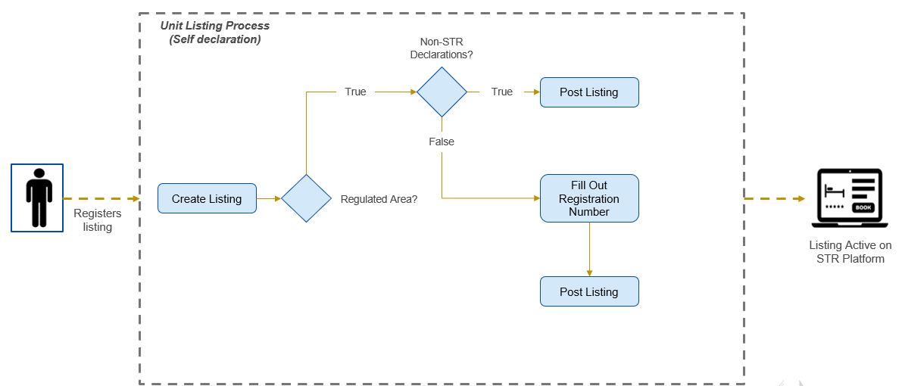

<p align="center">
  
</p>

| <span style="background-color:#1c4fa4; color:white">Settings</span>  | Value |
|-------------------|----------------------|
| Document Title   | D06.01 Report on the Prototype –Platforms |
| Project Title | Interoperability solutions in the area of Short-Term Rental (STR) services |
| Document Author | PwC EU Services |
| Project Owner |  DG GROW - European Commission |
| Project Manager | Travers Wouter  - PwC EU Services |

| Disclaimer  |
|-----------|
| This report was prepared for DG Grow  by PwC EU Services. The views expressed in this report are purely those of the authors and may not, in any circumstances, be interpreted as stating an official position of the European Commission. The European Commission does not guarantee the accuracy of the information included in this report, nor does it accept any responsibility for any use thereof. Reference herein to any specific products, specifications, process, or service by trade name, trademark, manufacturer, or otherwise, does not necessarily constitute or imply its endorsement, recommendation, or favouring by the European Commission. All care has been taken by the author to ensure that s/he has obtained, where necessary, permission to use any parts of manuscripts including illustrations, maps, and graphs, on which intellectual property rights already exist from the titular holder(s) of such rights or from her/his or their legal representative.|

# Table of Content

1. [Executive Summary](#1-executive-summary)
2. [Introduction](#2-introduction)
3. [Overview of the EU Regulation and Requirements](#3-overview-of-the-eu-regulation-and-requirements)
    - 3.1. [Background and objectives](#31-background-and-objectives)
    - 3.2. [Key compliance aspect](#32-key-compliance-aspect)
4. [API Endpoints and Usage](#4-api-endpoints-and-usage)
    - 4.1. [Endpoint specifications](#41-endpoint-specifications)
        - 4.1.1. [General Endpoints](#411-general-endpoints)
        - 4.1.2. [Endpoints for Platforms](#412-endpoints-for-platforms)
    - 4.2. [Authentication and authorization](#42-authentication-and-authorization)
        - [OAuth 2.0 Framework Roles](#oauth-20-framework-roles)
5. [Technical Infrastructure](#5-technical-infrastructure)
    - [User and Server Requests](#user-and-server-requests)
    - [Network Load Balancer (NLB)](#network-load-balancer-nlb)
    - [Nginx Ingress Controller](#nginx-ingress-controller)
    - [Kubernetes Service](#kubernetes-service)
    - [Pods](#pods)
    - [Persistent Volume Claim (PVC)](#persistent-volume-claim-pvc)
    - [Apache Kafka Integration](#apache-kafka-integration)
    - [Infrastructure Management](#infrastructure-management)
6. [Testing Steps](#6-testing-steps)
    - 6.1. [Via Terminal Commands](#61-via-terminal-commands)
        - 6.1.1. [Authentication](#611-authentication)
        - 6.1.2. [Get the OAUTH Token (from the /token endpoint)](#612-get-the-oauth-token-from-the-token-endpoint)
        - 6.1.3. [Define the HOST](#613-define-the-host)
        - 6.1.4. [Health Check Endpoint Test (endpoint 1 for platforms)](#614-health-check-endpoint-test-endpoint-1-for-platforms)
        - 6.1.5. [Submitting Activity Data Endpoint (endpoint 2 for platforms)](#615-submitting-activity-data-endpoint-endpoint-2-for-platforms)
        - 6.1.6. [Download Shapefiles Uploaded by Competent Authorities (endpoint 3 for platforms)](#616-download-shapefiles-uploaded-by-competent-authorities-endpoint-3-for-platforms)
        - 6.1.7. [Download List of Uploaded Shapefiles by Competent Authorities (endpoint 4 for platforms)](#617-download-list-of-uploaded-shapefiles-by-competent-authorities-endpoint-4-for-platforms)
        - 6.1.8. [Submit Listings Data Endpoint (endpoint 5 for platforms)](#618-submit-listings-data-endpoint-endpoint-5-for-platforms)
        - 6.1.9. [Registration Number Validation Check Endpoint (endpoint 6 for platforms)](#619-registration-number-validation-check-endpoint-endpoint-6-for-platforms)
        - 6.1.10. [Download List of STR Area Shapefiles (endpoint 7 for platforms)](#6110-download-list-of-str-area-shapefiles-endpoint-7-for-platforms)
        - 6.1.11. [Download STR Area Shapefile (endpoint 8 for platforms)](#6111-download-str-area-shapefile-endpoint-8-for-platforms)
    - 6.2. [Via Postman](#62-via-postman)
7. [Field Level Specification](#7-field-level-specification)

# 1. Executive Summary

The D06.01 Report on the Prototype – Platforms – provides a comprehensive overview of the interoperability solutions in the area of Short-Term Rental (STR) services, developed in response to the STR European Union regulations. The report, prepared by PwC EU Services for DG GROW - European Commission, outlines a prototype with best practices for the technical and regulatory framework necessary for STR platforms.

The report begins with an introduction to the EU regulation mandating the reporting of short-term rental activities. It details the regulation's background, objectives, and key compliance aspects, emphasizing the necessity for a Single Digital Entry Point (SDEP) to facilitate data integration and reporting.

The document provides detailed specifications for the API endpoints developed for data transmission. It includes practical examples of GET and POST requests, guiding developers on how to interact with the SDEP effectively and securely. The endpoints cover health checks, activity data submission, shapefile downloads, and invalid listing reports.

The report delves into the technical backbone of the prototype, explaining the use of Kubernetes for container orchestration, Pulumi for infrastructure as code, Go for backend services, AWS for cloud solutions, Kafka for data streaming, and Helm charts for managing Kubernetes applications. This section highlights the robust and scalable architecture designed to ensure secure and efficient data transmission.

Step-by-step instructions for setting up the environment and deploying the prototype are provided. This includes guidance on connecting to the API endpoints, ensuring accurate data transmission and validation, and leveraging tools like Postman for testing.

By following the guidelines and leveraging the resources provided in this report, developers and integrators will be well-equipped to ensure compliance with the EU regulation, contributing to the overarching goal of transparent and accountable short-term rental activities. The prototype's sophisticated technology stack and contemporary architectural patterns guarantee secure, scalable, and efficient data transmission, aligning with EU regulatory requirements and enhancing overall efficiency.

# 2. Introduction

In response to the recent European Union regulation requiring short-term rental (STR) platforms to transmit activity data to designated authorities via a Single Digital Entry Point (SDEP), this document offers detailed guidance on connecting to the newly established API endpoints. These endpoints are integral to a prototype designed to ensure compliance with this regulation, facilitating smooth data integration and reporting.

The prototype employs a sophisticated technology stack and contemporary architectural patterns to guarantee secure, scalable, and efficient data transmission. The employed technologies and methodologies include Kubernetes clusters for container orchestration, Pulumi for infrastructure as code, Go for backend service development, AWS Services for cloud infrastructure, Kafka architecture for reliable data streaming, Helm charts for Kubernetes application management, and standard API GET/POST requests for data interaction.

This document is organized to provide a thorough overview of each component, offering explicit instructions and best practices for effective API endpoint usage. By adhering to the guidelines presented, developers and integrators will be well-equipped to ensure compliance with the EU regulation, contributing to the overarching goal of transparent and accountable short-term rental activities.

By following the detailed instructions and leveraging the resources provided, stakeholders can achieve seamless integration with the Single Digital Entry Point, thereby aligning with EU regulatory requirements and enhancing overall efficiency.

# 3. Overview of the EU Regulation and Requirements

## 3.1. Background and Objectives

The development of the Short-Term Rental (STR) prototype represents a significant advancement in aligning with the new STR regulations aimed at standardizing and improving the management of short-term rental accommodations across EU Member States. This prototype is designed to capture and implement the key functionalities outlined in the STR framework, ensuring compliance with legal requirements and enhancing the efficiency of data exchanges between public authorities and STR platforms.

To achieve these goals, the prototype is based on a set of best practices that were developed earlier, following the guidelines provided in the STR framework legal documents. The STR framework details several key steps that underpin the management of short-term rentals. The process begins with hosts registering their rental units with the appropriate Competent Authority (CA), which could be at the national, regional, or local level (Step 1a). Following registration, hosts are required to declare their registration number when listing their unit on the platform (Step 1b). Platforms then have the responsibility to regularly verify the validity of these registration numbers and declarations (Step 2) through the Single Digital Entry Point (SDEP) (Step 3). The SDEP also plays a crucial role in publicizing the list of areas where registration is required (Step 4), enabling platforms to perform effective compliance checks. Furthermore, platforms are obligated to submit activity data (Step 5) to the relevant CA in regions where registration is mandatory, utilizing the SDEP to facilitate this reporting process.

<p align="center">
  
</p> 

While the framework establishes the regulatory groundwork, this report shifts focus towards the technical implementation of the functionality of the STR regulation and the developed recommendations. Specifically, this report covers the API endpoints and their usage, the underlying technical infrastructure, and the implementation steps that Member States can follow to deploy the prototype in their own environments. Additionally, it addresses best practices and security concerns that must be considered to ensure the system's effectiveness and integrity.

## 3.2. Key Compliance Aspect

The STR prototype was developed based on a set of user stories that were collaboratively agreed upon by a working group comprising representatives from several EU Member States and STR platforms. These user stories were designed to meet the minimum requirements of the STR regulation for both public authorities and platforms, ensuring that the prototype would effectively support compliance and facilitate the necessary data exchanges. Below is a breakdown of the key user stories:

### User Story 1: Host Registration

The first user story describes the process for hosts to register their short-term rental units with the relevant Competent Authority (CA). As this user story does not require any actions from the Platform, it is not expanded upon further in this version of the report.

### User Story 2: Unit Listing

In this user story, the focus shifts to how STR platforms handle the listing process for rental units. When a host lists a unit, they must declare their registration number if the unit is located in an area requiring registration. STR platforms are responsible for performing random checks on the existence or not of a registration procedure and the validity of these registration numbers through the Single Digital Entry Point (SDEP). If any discrepancies or issues arise, they must be reported to the CA.

<p align="center">
  
</p>  

Update, October 14th:
The meeting with the MS indicated there was misalignment regarding user story 2. Resolution steps are ongoing.

### User Story 3.1: Collection and Transmission of Activity Data Sharing

This user story details how STR platforms are required to collect and transmit activity data (number of nights for which a unit is rented and the number of guests to whom the unit is rented per night along with the country of residence of each guest) together with the corresponding registration number as provided by the host, the specific address of the unit, and the URL of the listing with public authorities. STR platforms transmit this data via the SDEP using the endpoint `POST/activity-data`, where it is cross-referenced with the CA’s registry to ensure compliance with the regulation.

<p align="center">
  
</p>  

### User Story 3.2: Area List Updates

This user story details how STR platforms can access and stay updated on geographical areas requiring registration and activity data reporting. This can be facilitated by the SDEP but is not mandatory. By using the `GET/area` and `GET/area[UL-ID]` endpoints, platforms can request the lists of areas where registration is mandatory and obtain the corresponding shapefiles. This ensures that platforms have the necessary information to ensure compliance with local regulations.

<p align="center">
  
</p>  

Update, February 24th: In the prototype, two additional endpoints have been introduced. One endpoint (str-area) identifies where STR regulation is applicable, and the other specifies where the Member State wishes to receive activity data (data-area). This approach could serve as a potential path for developing the area endpoint, as these shapefiles will typically be the same for both regulatory and data reporting purposes.

### User Story 3.3: Dispatching Activity Data

In this user story, the process of dispatching activity data to the appropriate Competent Authority is described. Since the filtering and dispatching of data occurs on the side of the Member States and their Competent Authorities, this process is less relevant for STR platforms.

### User Story 4: Share Flagged Listings

This user story covers the mechanism by which STR platforms share flagged listings with the relevant Competent Authority. While platforms are not obliged to use the SDEP, the SDEP can facilitate and simplify this process. When a platform flags a listing, it uses the SDEP and endpoint `POST/listings` to share this information. The system checks if the flagged listing falls within an area requiring registration, and if so, assigns the relevant Area ID. The Competent Authority can then retrieve flagged listings specific to their jurisdiction, ensuring effective oversight and enforcement. We recommend platforms to call this API on a monthly basis (e.g., every 15th of the month).

<p align="center">
  
</p>    

# 4. API Endpoints and Usage

## 4.1. Endpoint Specifications

### 4.1.1. General Endpoints

#### Health Check Endpoint

**Overview**

The health check endpoint is a critical component of the SDEP, designed to provide a quick and reliable way to assess the operational status of the service. This endpoint allows system administrators, developers, and automated monitoring tools to verify that the API is functioning correctly and is ready to handle requests.

**Endpoint Details**

- **URL:** `https://eu-str.sdep-pilot.eu/api/v0/ping`
- **Method:** `GET`

**Response Structure**

For the official technical specifications, please refer to the Swagger documentation available at the following link: [https://eu-str.sdep-pilot.eu/swagger/index.html#/](https://eu-str.sdep-pilot.eu/swagger/index.html#/)  

This resource contains all the necessary details regarding API endpoints and request/response formats. .

### 4.1.2. Endpoints for Platforms

### Submitting Activity Data Endpoint (Endpoint 1 for Platforms)

**Overview**

The activity data submission endpoint is designed to facilitate the transfer of activity data to the SDEP. This endpoint is for the periodic reporting of activity data.

**Technical Implementation**

- User Story 3.1
- User Story 3.3

**Endpoint Details**

- **URL:** `https://eu-str.sdep-pilot.eu/api/v0/str/activity-data`
- **Method:** `POST`
- **Content-Type:** `application/json`

**Sequencing**

1. Platforms Generate Activity Data in JSON format
2. Platform sends authentication request
3. SDEP sends access token to platform
4. Platform submits activity to the SDEP
5. SDEP sends activity report confirmation response “delivered”

**Response Structure**

For the official technical specifications, please refer to the Swagger documentation available at the following link: [https://eu-str.sdep-pilot.eu/swagger/index.html#/](https://eu-str.sdep-pilot.eu/swagger/index.html#/)  

This resource contains all the necessary details regarding API endpoints and request/response formats. .

---

#### Download List of Uploaded Shapefiles by Competent Authorities (Endpoint 2 for Platforms)

**Overview**

The shapefiles list retrieval endpoint is designed to provide platforms with a list of all available shapefiles that have been uploaded to the SDEP by competent authorities for which they want to receive activity data for. This endpoint allows platform applications to query and retrieve metadata about the shapefiles, enabling easier management, selection, and download of geospatial data.

**Technical Implementation**

- User Story 3.2

**Endpoint Details**

- **URL:** `https://eu-str.sdep-pilot.eu/api/v0/str/data-area`
- **Method:** `GET`

**Sequencing**

1. Member States upload Shapefiles to the SDEP
2. Platform sends authentication request
3. SDEP sends access token to platform
4. Platform submits request to GET the list of shapefiles on the SDEP
5. SDEP sends list of all shapefiles on the SDEP

**Response Structure**

For the official technical specifications, please refer to the Swagger documentation available at the following link: [https://eu-str.sdep-pilot.eu/swagger/index.html#/](https://eu-str.sdep-pilot.eu/swagger/index.html#/)  

This resource contains all the necessary details regarding API endpoints and request/response formats. .

---

#### Download Shapefiles Uploaded by Competent Authorities (Endpoint 3 for Platforms)

**Overview**

The shapefiles retrieval endpoint is designed to provide platforms with access to geospatial data in the form of shapefiles where Member States want to receive activity data for. This endpoint allows platforms to request and download shapefiles. As a shapefile consists of at least 3 mandatory files (.shp, .shx, .dbf) we expect these to be uploaded within a ZIP file to the SDEP, we highly recommend to upload the .prj and .cpg file which are the projection files (with the coordinate system and project information) and the .cpg file which specifies the code page for the .dbf file.

**Technical Implementation**

- User Story 3.2

**Endpoint Details**

- **URL:** `https://eu-str.sdep-pilot.eu/api/v0/str/data-area/{luid}`
- **Method:** `GET`
- **Parameters:**
    - `id` (path parameter, required): Shapefile ID

**Sequencing**

1. Member States upload Shapefiles to the SDEP
2. Platform sends authentication request
3. SDEP sends access token to platform
4. Platform submits request to GET a shapefile (based on the UL-ID)
5. SDEP sends requested shapefile

**Response Structure**

For the official technical specifications, please refer to the Swagger documentation available at the following link: [https://eu-str.sdep-pilot.eu/swagger/index.html#/](https://eu-str.sdep-pilot.eu/swagger/index.html#/)  

This resource contains all the necessary details regarding API endpoints and request/response formats. .

---

#### Post Invalid Listings (Endpoint 4 for Platforms)

**Overview**

The invalid listings submission endpoint is designed to allow platforms to report invalid or inappropriate listings.

**Technical Implementation**

- User Story 3.4

**Endpoint Details**

- **URL:** `https://eu-str.sdep-pilot.eu/api/v0/str/listings`
- **Method:** `POST`
- **Content-Type:** `application/json`

**Sequencing**

1. Platforms Generate Invalid Listing Data in JSON format
2. Platform sends authentication request
3. SDEP sends access token to platform
4. Platform submits invalid listing data to the SDEP
5. SDEP sends confirmation response “delivered”

**Response Structure**

For the official technical specifications, please refer to the Swagger documentation available at the following link: [https://eu-str.sdep-pilot.eu/swagger/index.html#/](https://eu-str.sdep-pilot.eu/swagger/index.html#/)  

This resource contains all the necessary details regarding API endpoints and request/response formats. .

---

#### Registration Number Validation (Endpoint 5 for Platforms)

**Overview**

This endpoint allows platforms to validate registration numbers.

**Technical Implementation**

- User Story 3.5

**Endpoint Details**

- **URL:** `https://eu-str.sdep-pilot.eu/api/v0/str/number-valid-check/{registrationNumber}`
- **Method:** `GET`
- Parameters:
    - `registrationNumber` (path parameter, required): Registration number to validate

**Sequencing**

1. Platforms Generate Invalid Listing Data in JSON format
2. Platform sends authentication request
3. SDEP sends access token to platform
4. Platform submits invalid listing data to the SDEP
5. SDEP sends confirmation response “delivered”

**Response Structure**

For the official technical specifications, please refer to the Swagger documentation available at the following link: [https://eu-str.sdep-pilot.eu/swagger/index.html#/](https://eu-str.sdep-pilot.eu/swagger/index.html#/)  

This resource contains all the necessary details regarding API endpoints and request/response formats. .

---

#### Download List of Uploaded Shapefiles by Competent Authorities where STR regulation is applicable (Endpoint 6 for Platforms)

**Overview**

The shapefiles list retrieval endpoint is designed to provide platforms with a list of all available shapefiles that have been uploaded to the SDEP by competent authorities where STR regulation is applicable. This endpoint allows platform applications to query and retrieve metadata about the shapefiles, enabling easier management, selection, and download of geospatial data.

**Technical Implementation**

- User Story 3.2

**Endpoint Details**

- **URL:** `https://eu-str.sdep-pilot.eu/api/v0/str/str-area`
- **Method:** `GET`

**Sequencing**

1. Member States upload Shapefiles to the SDEP
2. Platform sends authentication request
3. SDEP sends access token to platform
4. Platform submits request to GET the list of shapefiles on the SDEP
5. SDEP sends list of all shapefiles on the SDEP

**Response Structure**

For the official technical specifications, please refer to the Swagger documentation available at the following link: [https://eu-str.sdep-pilot.eu/swagger/index.html#/](https://eu-str.sdep-pilot.eu/swagger/index.html#/)  

This resource contains all the necessary details regarding API endpoints and request/response formats. .

---

#### Download Shapefiles Uploaded by Competent Authorities where STR regulation is applicable (Endpoint 7 for Platforms)

**Overview**

The shapefiles retrieval endpoint is designed to provide platforms with access to geospatial data in the form of shapefiles where the application procedure applies and where STR regulation is applicable. This endpoint allows platforms to request and download shapefiles. As a shapefile consists of at least 3 mandatory files (.shp, .shx, .dbf) we expect these to be uploaded within a ZIP file to the SDEP, we highly recommend to upload the .prj and .cpg file which are the projection files (with the coordinate system and project information) and the .cpg file which specifies the code page for the .dbf file.

**Technical Implementation**

- User Story 3.2

**Endpoint Details**

- **URL:** `https://eu-str.sdep-pilot.eu/api/v0/str/str-area/{luid}`
- **Method:** `GET`
- **Parameters:**
    - `id` (path parameter, required): Shapefile ID

**Sequencing**

1. Member States upload Shapefiles to the SDEP
2. Platform sends authentication request
3. SDEP sends access token to platform
4. Platform submits request to GET a shapefile (based on the UL-ID)
5. SDEP sends requested shapefile

**Response Structure**

For the official technical specifications, please refer to the Swagger documentation available at the following link: [https://eu-str.sdep-pilot.eu/swagger/index.html#/](https://eu-str.sdep-pilot.eu/swagger/index.html#/)  

This resource contains all the necessary details regarding API endpoints and request/response formats. .

## 4.2. Authentication and Authorization

OAuth 2.0 is utilized to handle authentication and authorization processes effectively. It is essential for auditing to be conducted on both the platform and government levels.

Integrating OAuth 2.0 with a RESTful API provides a secure way for platforms to share data with Competent Authorities while adhering to industry standards for authorization, ensuring secure access and the integrity of the data during transit within a REST architecture.

### OAuth 2.0 Framework Roles

- **Client:** The client in this scenario is the STR platform itself, which needs to access the competent authority's SDEP to send activity data. The STR platform acts on behalf of the user to request access to the resource server.
- **Resource Server:** The resource server is the server where the activity data is stored and managed. In this scenario, it would be the server hosting the competent authority's SDEP that the STR platform needs to interact with. This server holds the protected resources and is capable of accepting and responding to protected resource requests using access tokens.
- **Authorization Server:** The authorization server is the server that authenticates the identity of the STR platform and issues access tokens after getting proper authorization from the resource owner.

In the development of the SDEP, we have implemented several best practices to ensure the system's security, efficiency, and compliance with regulations. First, we have separated the authorization server from the resource server. This separation enhances both security and scalability by ensuring that the two functions are managed independently. Additionally, we utilize stateless access tokens in the form of JSON Web Tokens (JWT), which are self-contained and can be validated without the need to store session state, thereby increasing efficiency and reducing overhead.

Integrating OAuth 2.0 with a RESTful API is a secure and effective way to manage the authorization of data transmissions. By using the Client Credentials Grant and adhering to security best practices, the SDEP can provide authorized access to its data while maintaining the confidentiality, integrity, and availability of the information exchanged.

# 5. Technical Infrastructure

The SDEP prototype system outlined herein is an architecture designed to ensure high availability, reliability, and security for user and server interactions. The following section provides a structured overview of the key components and their roles within the system, emphasizing the harmonized interplay between modern technologies to deliver an efficient, scalable, and secure service.

<p align="center">
  
</p>  

## User and Server Requests

- **User Requests:** Users access the system via a web interface using `https://.../swagger/`.
- **Server Requests:** Servers make API calls directly using `https://.../api/v0/`.

Both types of requests are directed to a Network Load Balancer (NLB) to manage incoming traffic.

## Network Load Balancer (NLB)

The NLB is a critical component that distributes incoming traffic across multiple availability zones. Its primary function is to balance the load between backend servers to prevent any single server from becoming overwhelmed. This distribution ensures high availability and reliability of the service, maintaining consistent performance and preventing potential bottlenecks.

## Nginx Ingress Controller

Once the traffic is managed by the NLB, it is forwarded to the Nginx Ingress Controller. This controller manages external access to the services within the Kubernetes (EKS) cluster. It performs multiple roles:

- **Routing:** Directing requests to the appropriate services.
- **Load Balancing:** Further balancing the load to manage internal traffic efficiently.
- **Rate Limiting:** Enforcing limits on request rates to prevent overloading the system.

## Kubernetes Service

The Nginx Ingress Controller forwards requests to the designated Kubernetes Service. This service acts as a bridge between the external requests and internal Pods, translating user and server requests into actionable tasks for the internal infrastructure.

## Deployment

Within the Kubernetes environment, Deployments ensure that the desired number of Pod replicas are running and available to handle incoming requests. This mechanism guarantees scalability and resilience, adapting to varying loads by maintaining an optimal number of Pods.

## Pods

Pods are the smallest deployable units in Kubernetes, encapsulating application containers and their resources. They are managed by Deployments to ensure availability and scalability, responding to requests with efficiency.

### Security

- **Kubernetes Secrets:** Secrets are used to manage sensitive information such as API keys, passwords, and certificates. They provide secure storage and access control, ensuring that sensitive data is protected.
- **Let's Encrypt:** Let's Encrypt is utilized to obtain SSL/TLS certificates. These certificates secure communications between clients and services, ensuring data integrity and confidentiality.

## Persistent Volume Claim (PVC)

PVCs are used to request storage resources within the EKS cluster. They enable Pods to persist data beyond their lifecycle, ensuring data continuity and integrity even if Pods are destroyed and recreated.

## Apache Kafka Integration

In addition to the components outlined above, the SDEP prototype system integrates Apache Kafka to enhance data streaming and messaging capabilities. Kafka plays a crucial role in ensuring real-time data processing, fault tolerance, and scalability across the system.

- **Real-Time Data Streaming:** Kafka acts as a high-throughput, low-latency platform for handling real-time data streams. It enables the system to process user and server requests as well as internal events in real-time, ensuring up-to-date information and quick responses.
- **Decoupling of Services:** By using Kafka, the system achieves a higher degree of decoupling between services. Different components can produce and consume messages independently, facilitating a more modular and maintainable architecture.
- **Fault Tolerance:** Kafka's distributed nature ensures fault tolerance and high availability. Data is replicated across multiple brokers, ensuring that even if one broker fails, the system can continue to operate without data loss.
- **Scalability:** Kafka's partitioning feature allows the system to scale horizontally by distributing the data load across multiple partitions. This ensures that the system can handle increasing loads efficiently.
- **Event Sourcing:** Kafka is used for event sourcing within the SDEP architecture. Each change in the system state is captured as an event and stored in Kafka. This enables a reliable audit trail and the ability to reconstruct the system state at any point in time.

## Infrastructure Management

- **Helm:** Helm is a package manager for Kubernetes, used to define, install, and upgrade complex Kubernetes applications. It automates deployment processes, ensuring consistency and reducing manual errors. Helm can also be seen as a kind of template engine, making it possible to provide configuration values and apply them on the template.
- **Pulumi:** Pulumi is an infrastructure as code tool that allows the definition of infrastructure using familiar programming languages. It is used to provision and manage infrastructure resources, bridging the gap between development and operations.

The SDEP prototype presents a robust architecture leveraging modern technologies to ensure high availability, security, and scalability. From the initial request handling by the NLB to the secure management of sensitive data using Kubernetes Secrets and Let's Encrypt, each component plays a vital role in maintaining the integrity and performance of the system. The use of Helm and Pulumi further enhances the infrastructure management, providing automation and consistency in deployment and operations.

This structured and formal architecture ensures that the system can efficiently handle varying loads, secure sensitive data, and maintain high availability.

# 6.1. Via Terminal Commands

## 6.1.1. Authentication

First, authenticate via the Privatebin that has been shared via email. Be aware that this link expires after 7 days, so please store your credentials safely. If you have not received credentials yet, please contact [wouter.travers@pwc.com](mailto:wouter.travers@pwc.com) or [victor.vanhullebusch@pwc.com](mailto:victor.vanhullebusch@pwc.com).

```bash
CLIENT_ID=[Your-ID] \
CLIENT_SECRET=[Your-Secret]
```

## 6.1.2. Get the OAUTH Token (from the /token endpoint)

```bash
# Compose the JSON string using jq
DATA=$(jq -n \
          --arg client_id "$CLIENT_ID" \
          --arg client_secret "$CLIENT_SECRET" \
          --arg audience "https://str.eu" \
          --arg grant_type "client_credentials" \
          '{client_id: $client_id, client_secret: $client_secret, audience: $audience, grant_type: $grant_type}')

# Get the token          
TOKEN=$(curl -s --request POST \
  --url https://tt-dp-dev.eu.auth0.com/oauth/token \
  --header 'content-type: application/json' \
  --data $DATA | jq -r .access_token )
```

## 6.1.3. Define the HOST

```bash
HOST=eu-str.sdep-pilot.eu
```

## 6.1.4. Health Check Endpoint Test (endpoint 1 for platforms)

```bash
curl -s https://$HOST/api/v0/ping | jq -r .
```

## 6.1.5. Submitting Activity Data Endpoint (endpoint 2 for platforms)

```bash
curl -s -X POST https://$HOST/api/v0/str/activity-data \
--header "Authorization: Bearer $TOKEN" \
--header "Content-Type: application/json" \
--data '{
  "data": [
    {
      "URL": "placeholder-URL",
      "address": {
        "city": "Diegem",
        "country": "BEL",
        "postalCode": "1831",
        "street": "Culliganlaan 5"
      },
      "countryOfGuests": [
        "ITA",
        "NLD"
      ],
      "numberOfGuests": 3,
      "registrationNumber": "placeholder-registrationNumber",
      "temporal": {
        "endDateTime": "2024-07-25T17:32:28Z",
        "startDateTime": "2024-07-21T17:32:28Z"
      }
    }
  ],
  "metadata": {
    "platform": "booking.com",
    "submissionDate": "2024-07-21T17:32:28Z"
  }
}' \
| jq .
```

## 6.1.6. Download Shapefiles Uploaded by Competent Authorities (endpoint 3 for platforms)

```bash
curl -s https://$HOST/api/v0/str/data-area/[luid] \
--header "Authorization: Bearer $TOKEN" \
-o downloaded_shape_file.zip
```

## 6.1.7. Download List of Uploaded Shapefiles by Competent Authorities (endpoint 4 for platforms)

```bash
curl -s https://$HOST/api/v0/str/data-area \
--header "Authorization: Bearer $TOKEN" \
| jq .
```

## 6.1.8. Submit Listings Data Endpoint (endpoint 5 for platforms)

```bash
curl -s -X POST https://$HOST/api/v0/str/listings \
--header "Authorization: Bearer $TOKEN" \
--header "Content-Type: application/json" \
--data '{
  "data": [
    {
      "Unit": {
        "address": {
          "street": "Culliganlaan 5",
          "city": "Diegem",
          "postalCode": "1831",
          "country": "BEL"
        },
        "description": "Luxury apartment",
        "floorLevel": "2",
        "numberOfRooms": 3,
        "obtainedAuth": true,
        "occupancy": 6,
        "purpose": "Residential",
        "type": "Apartment",
        "url": "https://example.com/listing"
      },
      "competentAuthorityId_area": "competentAuthorityId_area",
      "competentAuthorityName_area": "competentAuthorityName_area",
      "registrationNumber": "placeholder-registrationNumber"
    }
  ],
  "metadata": {
    "platform": "booking.com",
    "submissionDate": "2024-07-21T17:32:28Z",
  }
}' \
| jq .
```

## 6.1.9. Registration Number Validation Check Endpoint (endpoint 6 for platforms)

```bash
curl -s https://$HOST/api/v0/str/number-valid-check/placeholder-registrationNumber \
--header "Authorization: Bearer $TOKEN" \
| jq .
```
## 6.1.10. Download List of STR Area Shapefiles (endpoint 7 for platforms)

```bash
curl -s https://$HOST/api/v0/str/str-area \
--header "Authorization: Bearer $TOKEN" \
| jq .
```

## 6.1.11. Download STR Area Shapefiles (endpoint 8 for platforms)

```bash
curl -s https://$HOST/api/v0/str/str-area/[luid] \
--header "Authorization: Bearer $TOKEN" \
-o downloaded_str_shape_file.zip
```

# 6.2. Via Postman

To get started with testing the STR application using Postman, follow these steps:

1. **Download and install Postman.**

2. **Import the Collection from the Postman folder:**
    - Open Postman and go to "File" > "Import".
    - Select the collection JSON file to import from Github.

3. **Import the Environment:**
    - Go to "Manage Environments" (the gear icon in the top-right).
    - Click "Import" and select the environment JSON file from Github.

4. **Set Up Personal Credentials:**
    - After importing the environment, go to "Manage Environments".
    - Edit the imported environment and replace placeholder values with actual credentials.

5. After importing the collection, please do not forget to add your personal environment by selecting it in the top right.

By following these steps, you can set up and test the STR application efficiently using Postman.

# 7. Field Level Specification
## POST /str/activity-data

### Body Structure

#### Path: `data`
**Required**: Yes  
**Description**: An array of report entries, each detailing a short-term rental stay

#### Path: `metadata`
**Required**: Yes  
**Description**: Metadata describing the submission context

---

### `data[]` Fields

- **`data[].URL`**  
  **Required**: Yes  
  **Description**: URL of the rental listing or reference

- **`data[].address`**  
  **Description**: Object containing address details

  - **`data[].address.city`**  
    **Required**: Yes  
    **Description**: City name

  - **`data[].address.country`**  
    **Required**: Yes  
    **Description**: Country code (ISO 3166-1 alpha-3)

  - **`data[].address.postalCode`**  
    **Required**: Yes  
    **Description**: Postal or ZIP code

  - **`data[].address.street`**  
    **Required**: Yes  
    **Description**: Street address

- **`data[].countryOfGuests`**  
  **Required**: Yes  
  **Description**: List of ISO 3166-1 alpha-3 codes representing countries of guests

- **`data[].numberOfGuests`**  
  **Required**: Yes  
  **Description**: Total number of guests for the stay

- **`data[].registrationNumber`**  
  **Required**: Yes  
  **Description**: Short-term rental registration number

- **`data[].temporal`**  
  **Description**: Object containing start and end of the stay

  - **`data[].temporal.startDateTime`**  
    **Required**: Yes  
    **Description**: Start datetime of the stay (ISO 8601 format)

  - **`data[].temporal.endDateTime`**  
    **Required**: Yes  
    **Description**: End datetime of the stay (ISO 8601 format)

---

### `metadata` Fields

- **`metadata.platform`**  
  **Required**: Yes  
  **Description**: Platform name from which the data originates (e.g., booking.com)

- **`metadata.submissionDate`**  
  **Required**: Yes  
  **Description**: Submission timestamp in ISO 8601 format

---

## POST /str/listing

### Body Structure

#### Path: `data`
**Required**: Yes  
**Description**: Array of unit registration entries

#### Path: `metadata`
**Required**: Yes  
**Description**: Metadata about the submission, such as platform and submission date

---

### `data[]` Fields

- **`data[].Unit`**  
  **Description**: Object containing details about the rental unit

  - **`data[].Unit.address`**  
    **Description**: Object specifying the address of the unit

    - **`data[].Unit.address.city`**  
      **Required**: Yes  
      **Description**: City where the unit is located

    - **`data[].Unit.address.country`**  
      **Required**: Yes  
      **Description**: Country code (ISO 3166-1 alpha-3)

    - **`data[].Unit.address.postalCode`**  
      **Required**: Yes  
      **Description**: Postal/ZIP code of the unit

    - **`data[].Unit.address.street`**  
      **Required**: Yes  
      **Description**: Street address

  - **`data[].Unit.description`**  
    **Required**: Optional  
    **Description**: Description of the unit

  - **`data[].Unit.floorLevel`**  
    **Required**: Optional  
    **Description**: Floor level the unit is on (e.g., "2nd floor")

  - **`data[].Unit.numberOfRooms`**  
    **Required**: Optional  
    **Description**: Total number of rooms in the unit

  - **`data[].Unit.obtainedAuth`**  
    **Required**: Yes  
    **Description**: Boolean indicating whether authorization was obtained

  - **`data[].Unit.occupancy`**  
    **Required**: Optional  
    **Description**: Maximum allowed number of occupants

  - **`data[].Unit.purpose`**  
    **Required**: Optional  
    **Description**: Purpose of the unit use (e.g., tourist lodging, residential, etc.)

  - **`data[].Unit.type`**  
    **Required**: Optional  
    **Description**: Type of unit (e.g., apartment, house)

  - **`data[].Unit.url`**  
    **Required**: Yes  
    **Description**: URL to the listing or unit information

- **`data[].competentAuthorityId_area`**  
  **Required**: Yes  
  **Description**: ID of the competent authority in the jurisdiction

- **`data[].competentAuthorityName_area`**  
  **Required**: Yes  
  **Description**: Name of the competent authority

- **`data[].registrationNumber`**  
  **Required**: Yes  
  **Description**: Registration number of the unit

---

### `metadata` Fields

- **`metadata.platform`**  
  **Required**: Yes  
  **Description**: Platform submitting the data (e.g., booking.com)

- **`metadata.submissionDate`**  
  **Required**: Yes  
  **Description**: ISO 8601 formatted submission date


